# Toàn bộ mã Mermaid

Mỗi khối dưới đây dán thẳng được vào draw.io (Sắp xếp → Chèn → Nâng cao → Mermaid) hoặc mermaid.live.

## Use case

### UC00 – Use case tổng quát hệ thống LingoPrism

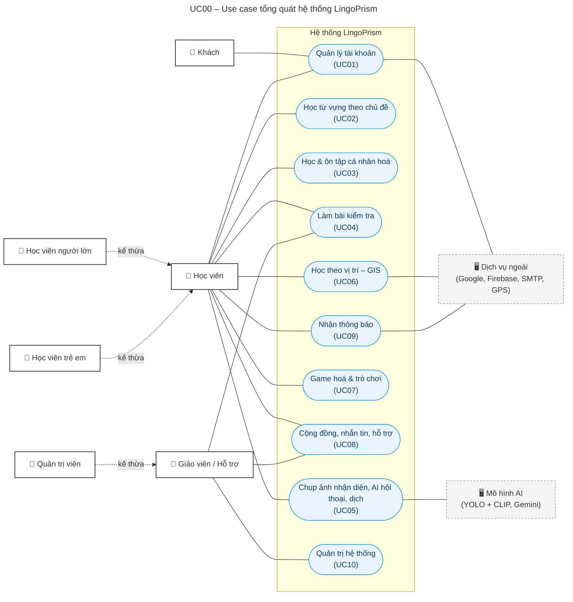
```mermaid
---
title: "UC00 – Use case tổng quát hệ thống LingoPrism"
---
flowchart LR
    Guest["👤 Khách"]:::actor
    Learner["👤 Học viên"]:::actor
    Adult["👤 Học viên người lớn"]:::actor
    Kid["👤 Học viên trẻ em"]:::actor
    Staff["👤 Giáo viên / Hỗ trợ"]:::actor
    Admin["👤 Quản trị viên"]:::actor
    AI["🖥 Mô hình AI<br/>(YOLO + CLIP, Gemini)"]:::ext
    Ext["🖥 Dịch vụ ngoài<br/>(Google, Firebase, SMTP, GPS)"]:::ext

    Adult -. kế thừa .-> Learner
    Kid -. kế thừa .-> Learner
    Admin -. kế thừa .-> Staff

    subgraph SYS["Hệ thống LingoPrism"]
        U1(["Quản lý tài khoản<br/>(UC01)"]):::uc
        U2(["Học từ vựng theo chủ đề<br/>(UC02)"]):::uc
        U3(["Học & ôn tập cá nhân hoá<br/>(UC03)"]):::uc
        U4(["Làm bài kiểm tra<br/>(UC04)"]):::uc
        U5(["Chụp ảnh nhận diện, AI hội thoại, dịch<br/>(UC05)"]):::uc
        U6(["Học theo vị trí – GIS<br/>(UC06)"]):::uc
        U7(["Game hoá & trò chơi<br/>(UC07)"]):::uc
        U8(["Cộng đồng, nhắn tin, hỗ trợ<br/>(UC08)"]):::uc
        U9(["Nhận thông báo<br/>(UC09)"]):::uc
        U10(["Quản trị hệ thống<br/>(UC10)"]):::uc
    end

    Guest --- U1
    Learner --- U1 & U2 & U3 & U4 & U5 & U6 & U7 & U8 & U9
    Staff --- U4 & U8 & U10
    U5 --- AI
    U1 & U6 & U9 --- Ext

    classDef actor fill:#fff,stroke:#333,stroke-width:1.5px
    classDef uc fill:#eaf4fe,stroke:#1899f0,color:#0b3b66
    classDef ext fill:#f5f5f5,stroke:#888,stroke-dasharray:4 3
```

### UC01 – Quản lý tài khoản (apps.accounts)

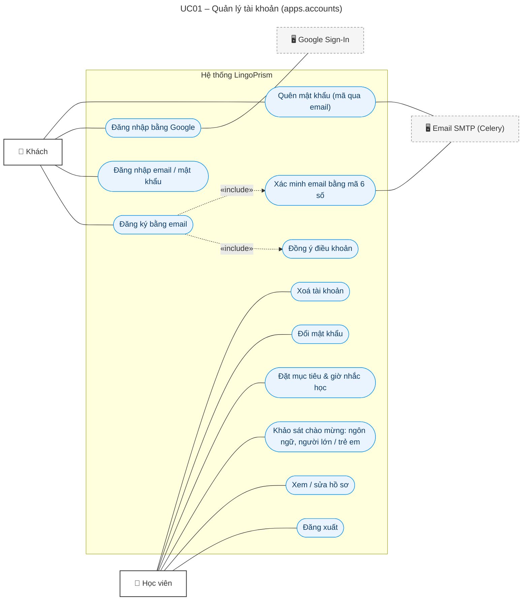
```mermaid
---
title: "UC01 – Quản lý tài khoản (apps.accounts)"
---
flowchart LR
    Guest["👤 Khách"]:::actor
    Learner["👤 Học viên"]:::actor
    Google["🖥 Google Sign-In"]:::ext
    Mail["🖥 Email SMTP (Celery)"]:::ext
    subgraph SYS["Hệ thống LingoPrism"]
        R(["Đăng ký bằng email"]):::uc
        V(["Xác minh email bằng mã 6 số"]):::uc
        L(["Đăng nhập email / mật khẩu"]):::uc
        G(["Đăng nhập bằng Google"]):::uc
        F(["Quên mật khẩu (mã qua email)"]):::uc
        O(["Đăng xuất"]):::uc
        P(["Xem / sửa hồ sơ"]):::uc
        S(["Khảo sát chào mừng: ngôn ngữ, người lớn / trẻ em"]):::uc
        K(["Đặt mục tiêu & giờ nhắc học"]):::uc
        C(["Đổi mật khẩu"]):::uc
        D(["Xoá tài khoản"]):::uc
        T(["Đồng ý điều khoản"]):::uc
    end
    Guest --- R & L & G & F
    Learner --- O & P & S & K & C & D
    R -. «include» .-> T
    R -. «include» .-> V
    V --- Mail
    F --- Mail
    G --- Google

    classDef actor fill:#fff,stroke:#333,stroke-width:1.5px
    classDef uc fill:#eaf4fe,stroke:#1899f0,color:#0b3b66
    classDef ext fill:#f5f5f5,stroke:#888,stroke-dasharray:4 3
```

### UC02 – Học từ vựng theo chủ đề (apps.vocab, apps.learning)

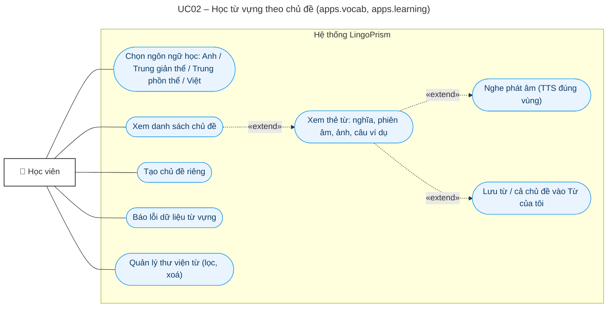
```mermaid
---
title: "UC02 – Học từ vựng theo chủ đề (apps.vocab, apps.learning)"
---
flowchart LR
    Learner["👤 Học viên"]:::actor
    subgraph SYS["Hệ thống LingoPrism"]
        A(["Chọn ngôn ngữ học: Anh / Trung giản thể / Trung phồn thể / Việt"]):::uc
        B(["Xem danh sách chủ đề"]):::uc
        C(["Xem thẻ từ: nghĩa, phiên âm, ảnh, câu ví dụ"]):::uc
        D(["Nghe phát âm (TTS đúng vùng)"]):::uc
        E(["Lưu từ / cả chủ đề vào Từ của tôi"]):::uc
        F(["Tạo chủ đề riêng"]):::uc
        G(["Báo lỗi dữ liệu từ vựng"]):::uc
        H(["Quản lý thư viện từ (lọc, xoá)"]):::uc
    end
    Learner --- A & B & F & G & H
    B -. «extend» .-> C
    C -. «extend» .-> D
    C -. «extend» .-> E

    classDef actor fill:#fff,stroke:#333,stroke-width:1.5px
    classDef uc fill:#eaf4fe,stroke:#1899f0,color:#0b3b66
    classDef ext fill:#f5f5f5,stroke:#888,stroke-dasharray:4 3
```

### UC03 – Học & ôn tập cá nhân hoá (apps.learning, apps.literacy, apps.algorithms)

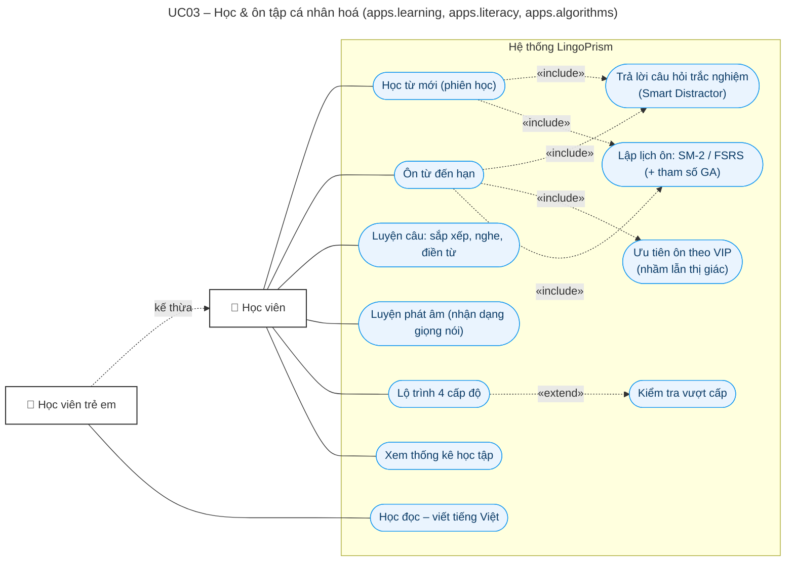
```mermaid
---
title: "UC03 – Học & ôn tập cá nhân hoá (apps.learning, apps.literacy, apps.algorithms)"
---
flowchart LR
    Learner["👤 Học viên"]:::actor
    Kid["👤 Học viên trẻ em"]:::actor
    Kid -. kế thừa .-> Learner
    subgraph SYS["Hệ thống LingoPrism"]
        A(["Học từ mới (phiên học)"]):::uc
        B(["Ôn từ đến hạn"]):::uc
        S(["Lập lịch ôn: SM-2 / FSRS (+ tham số GA)"]):::uc
        V(["Ưu tiên ôn theo VIP<br/>(nhầm lẫn thị giác)"]):::uc
        Q(["Trả lời câu hỏi trắc nghiệm<br/>(Smart Distractor)"]):::uc
        C(["Luyện câu: sắp xếp, nghe, điền từ"]):::uc
        P(["Luyện phát âm (nhận dạng giọng nói)"]):::uc
        L(["Lộ trình 4 cấp độ"]):::uc
        T(["Kiểm tra vượt cấp"]):::uc
        R(["Học đọc – viết tiếng Việt"]):::uc
        X(["Xem thống kê học tập"]):::uc
    end
    Learner --- A & B & C & P & L & X
    Kid --- R
    A & B -. «include» .-> Q
    B -. «include» .-> V
    A & B -. «include» .-> S
    L -. «extend» .-> T

    classDef actor fill:#fff,stroke:#333,stroke-width:1.5px
    classDef uc fill:#eaf4fe,stroke:#1899f0,color:#0b3b66
    classDef ext fill:#f5f5f5,stroke:#888,stroke-dasharray:4 3
```

### UC04 – Bài kiểm tra (apps.quizzes)

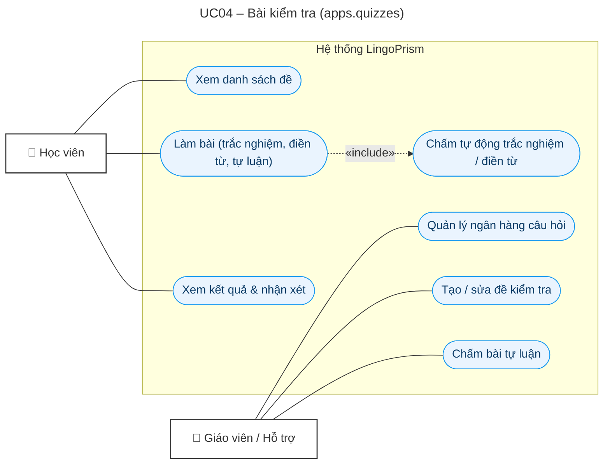
```mermaid
---
title: "UC04 – Bài kiểm tra (apps.quizzes)"
---
flowchart LR
    Learner["👤 Học viên"]:::actor
    Staff["👤 Giáo viên / Hỗ trợ"]:::actor
    subgraph SYS["Hệ thống LingoPrism"]
        A(["Xem danh sách đề"]):::uc
        B(["Làm bài (trắc nghiệm, điền từ, tự luận)"]):::uc
        C(["Chấm tự động trắc nghiệm / điền từ"]):::uc
        D(["Xem kết quả & nhận xét"]):::uc
        E(["Quản lý ngân hàng câu hỏi"]):::uc
        F(["Tạo / sửa đề kiểm tra"]):::uc
        G(["Chấm bài tự luận"]):::uc
    end
    Learner --- A & B & D
    Staff --- E & F & G
    B -. «include» .-> C

    classDef actor fill:#fff,stroke:#333,stroke-width:1.5px
    classDef uc fill:#eaf4fe,stroke:#1899f0,color:#0b3b66
    classDef ext fill:#f5f5f5,stroke:#888,stroke-dasharray:4 3
```

### UC05 – Chụp ảnh nhận diện, hội thoại AI và dịch (apps.detection, apps.aitalk)

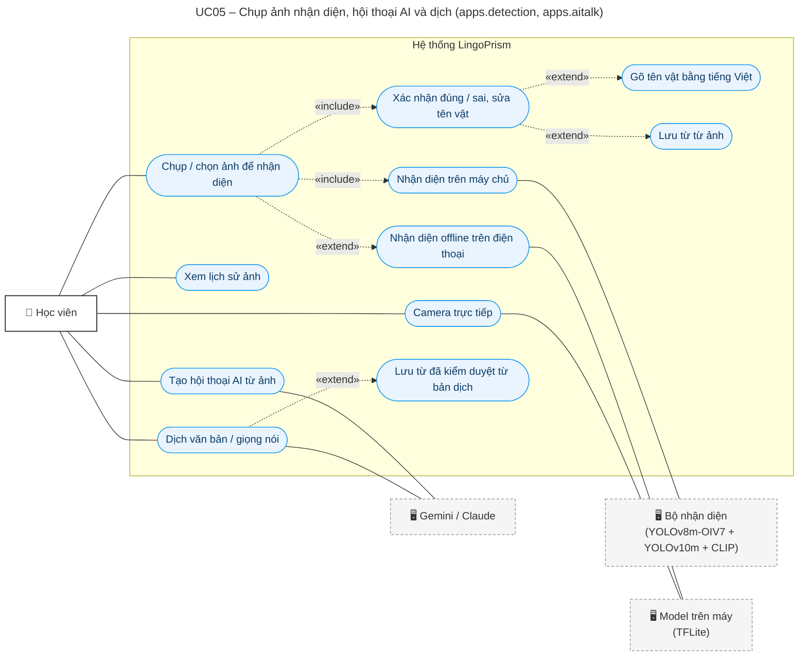
```mermaid
---
title: "UC05 – Chụp ảnh nhận diện, hội thoại AI và dịch (apps.detection, apps.aitalk)"
---
flowchart LR
    Learner["👤 Học viên"]:::actor
    Det["🖥 Bộ nhận diện<br/>(YOLOv8m-OIV7 + YOLOv10m + CLIP)"]:::ext
    Phone["🖥 Model trên máy<br/>(TFLite)"]:::ext
    LLM["🖥 Gemini / Claude"]:::ext
    subgraph SYS["Hệ thống LingoPrism"]
        A(["Chụp / chọn ảnh để nhận diện"]):::uc
        B(["Nhận diện trên máy chủ"]):::uc
        C(["Nhận diện offline trên điện thoại"]):::uc
        D(["Camera trực tiếp"]):::uc
        E(["Xác nhận đúng / sai, sửa tên vật"]):::uc
        F(["Gõ tên vật bằng tiếng Việt"]):::uc
        G(["Lưu từ từ ảnh"]):::uc
        H(["Xem lịch sử ảnh"]):::uc
        I(["Tạo hội thoại AI từ ảnh"]):::uc
        J(["Dịch văn bản / giọng nói"]):::uc
        K(["Lưu từ đã kiểm duyệt từ bản dịch"]):::uc
    end
    Learner --- A & D & H & I & J
    A -. «include» .-> B
    A -. «extend» .-> C
    A -. «include» .-> E
    E -. «extend» .-> F
    E -. «extend» .-> G
    J -. «extend» .-> K
    B --- Det
    C & D --- Phone
    I & J --- LLM

    classDef actor fill:#fff,stroke:#333,stroke-width:1.5px
    classDef uc fill:#eaf4fe,stroke:#1899f0,color:#0b3b66
    classDef ext fill:#f5f5f5,stroke:#888,stroke-dasharray:4 3
```

### UC06 – Học theo vị trí (GIS, Proximity Search, Geofencing) (apps.gis, apps.algorithms.proximity)

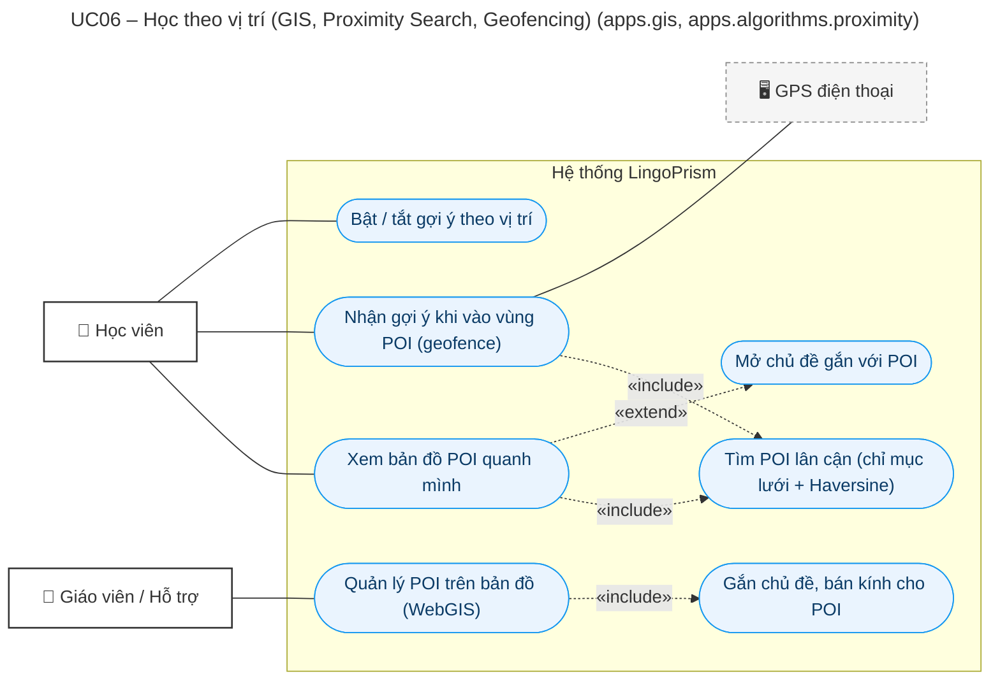
```mermaid
---
title: "UC06 – Học theo vị trí (GIS, Proximity Search, Geofencing) (apps.gis, apps.algorithms.proximity)"
---
flowchart LR
    Learner["👤 Học viên"]:::actor
    Staff["👤 Giáo viên / Hỗ trợ"]:::actor
    GPS["🖥 GPS điện thoại"]:::ext
    subgraph SYS["Hệ thống LingoPrism"]
        A(["Xem bản đồ POI quanh mình"]):::uc
        B(["Tìm POI lân cận (chỉ mục lưới + Haversine)"]):::uc
        C(["Mở chủ đề gắn với POI"]):::uc
        D(["Nhận gợi ý khi vào vùng POI (geofence)"]):::uc
        E(["Bật / tắt gợi ý theo vị trí"]):::uc
        F(["Quản lý POI trên bản đồ (WebGIS)"]):::uc
        G(["Gắn chủ đề, bán kính cho POI"]):::uc
    end
    Learner --- A & D & E
    Staff --- F
    A -. «include» .-> B
    A -. «extend» .-> C
    D -. «include» .-> B
    F -. «include» .-> G
    D --- GPS

    classDef actor fill:#fff,stroke:#333,stroke-width:1.5px
    classDef uc fill:#eaf4fe,stroke:#1899f0,color:#0b3b66
    classDef ext fill:#f5f5f5,stroke:#888,stroke-dasharray:4 3
```

### UC07 – Game hoá và trò chơi (apps.gamification, apps.games)

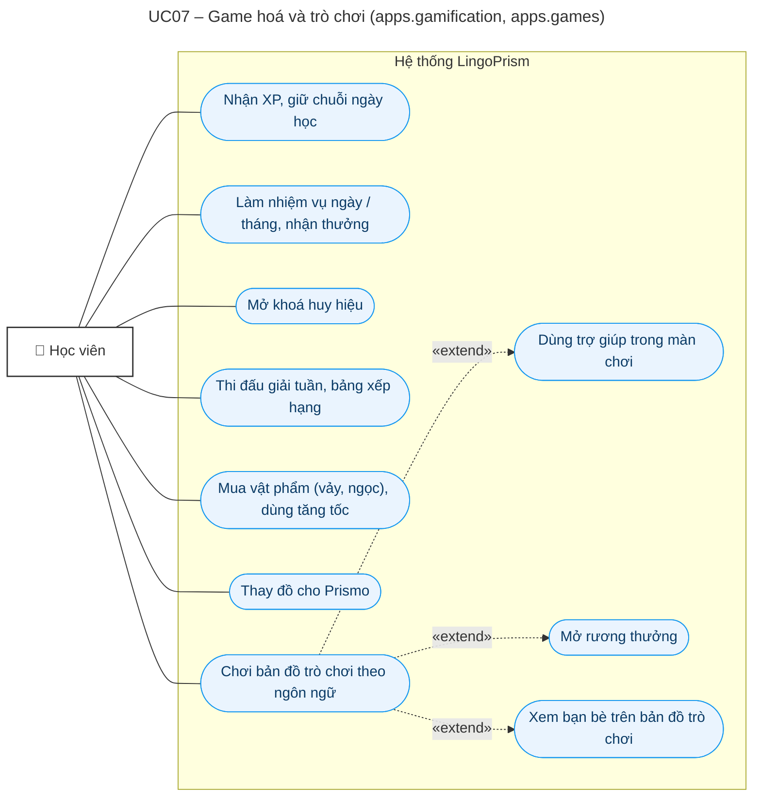
```mermaid
---
title: "UC07 – Game hoá và trò chơi (apps.gamification, apps.games)"
---
flowchart LR
    Learner["👤 Học viên"]:::actor
    subgraph SYS["Hệ thống LingoPrism"]
        A(["Nhận XP, giữ chuỗi ngày học"]):::uc
        B(["Làm nhiệm vụ ngày / tháng, nhận thưởng"]):::uc
        C(["Mở khoá huy hiệu"]):::uc
        D(["Thi đấu giải tuần, bảng xếp hạng"]):::uc
        E(["Mua vật phẩm (vảy, ngọc), dùng tăng tốc"]):::uc
        F(["Thay đồ cho Prismo"]):::uc
        G(["Chơi bản đồ trò chơi theo ngôn ngữ"]):::uc
        H(["Dùng trợ giúp trong màn chơi"]):::uc
        I(["Mở rương thưởng"]):::uc
        J(["Xem bạn bè trên bản đồ trò chơi"]):::uc
    end
    Learner --- A & B & C & D & E & F & G
    G -. «extend» .-> H
    G -. «extend» .-> I
    G -. «extend» .-> J

    classDef actor fill:#fff,stroke:#333,stroke-width:1.5px
    classDef uc fill:#eaf4fe,stroke:#1899f0,color:#0b3b66
    classDef ext fill:#f5f5f5,stroke:#888,stroke-dasharray:4 3
```

### UC08 – Cộng đồng, nhắn tin và hỗ trợ (apps.community, apps.chat)

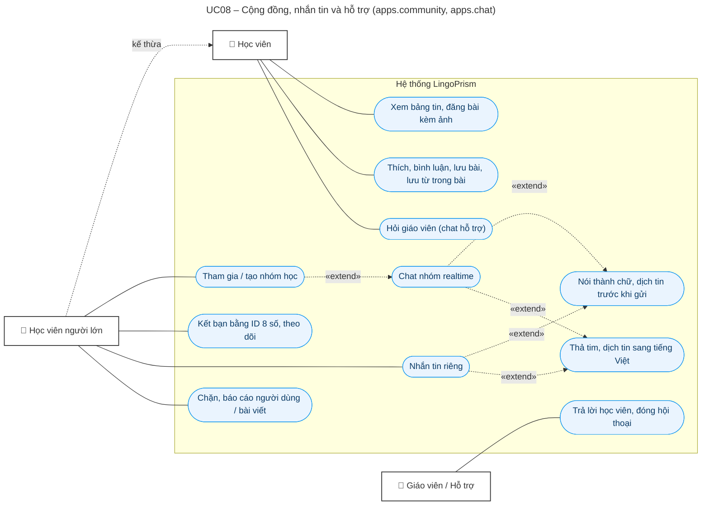
```mermaid
---
title: "UC08 – Cộng đồng, nhắn tin và hỗ trợ (apps.community, apps.chat)"
---
flowchart LR
    Adult["👤 Học viên người lớn"]:::actor
    Learner["👤 Học viên"]:::actor
    Staff["👤 Giáo viên / Hỗ trợ"]:::actor
    Adult -. kế thừa .-> Learner
    subgraph SYS["Hệ thống LingoPrism"]
        A(["Xem bảng tin, đăng bài kèm ảnh"]):::uc
        B(["Thích, bình luận, lưu bài, lưu từ trong bài"]):::uc
        C(["Tham gia / tạo nhóm học"]):::uc
        D(["Chat nhóm realtime"]):::uc
        E(["Kết bạn bằng ID 8 số, theo dõi"]):::uc
        F(["Nhắn tin riêng"]):::uc
        G(["Nói thành chữ, dịch tin trước khi gửi"]):::uc
        H(["Thả tim, dịch tin sang tiếng Việt"]):::uc
        I(["Chặn, báo cáo người dùng / bài viết"]):::uc
        J(["Hỏi giáo viên (chat hỗ trợ)"]):::uc
        K(["Trả lời học viên, đóng hội thoại"]):::uc
    end
    Learner --- A & B & J
    Adult --- C & E & F & I
    Staff --- K
    C -. «extend» .-> D
    D & F -. «extend» .-> G
    D & F -. «extend» .-> H

    classDef actor fill:#fff,stroke:#333,stroke-width:1.5px
    classDef uc fill:#eaf4fe,stroke:#1899f0,color:#0b3b66
    classDef ext fill:#f5f5f5,stroke:#888,stroke-dasharray:4 3
```

### UC09 – Thông báo (apps.notifications, apps.push)

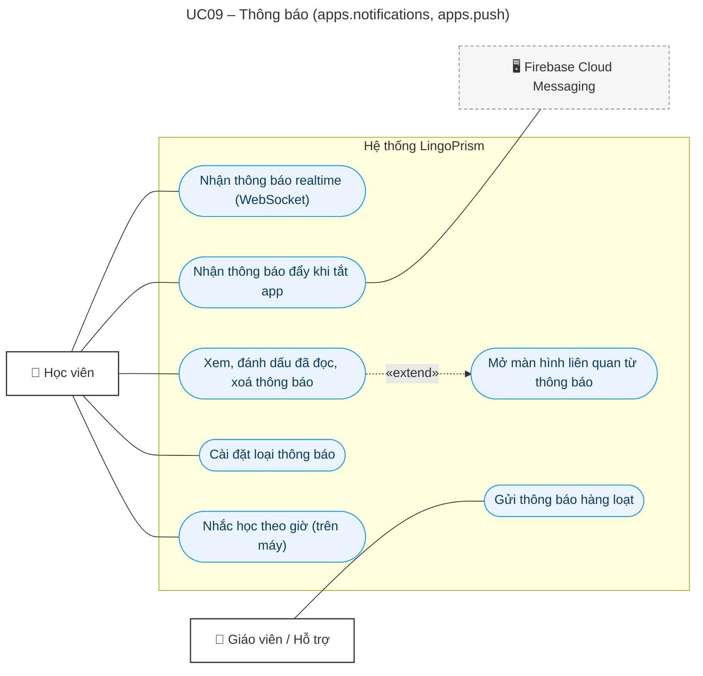
```mermaid
---
title: "UC09 – Thông báo (apps.notifications, apps.push)"
---
flowchart LR
    Learner["👤 Học viên"]:::actor
    Staff["👤 Giáo viên / Hỗ trợ"]:::actor
    FCM["🖥 Firebase Cloud Messaging"]:::ext
    subgraph SYS["Hệ thống LingoPrism"]
        A(["Nhận thông báo realtime (WebSocket)"]):::uc
        B(["Nhận thông báo đẩy khi tắt app"]):::uc
        C(["Xem, đánh dấu đã đọc, xoá thông báo"]):::uc
        D(["Mở màn hình liên quan từ thông báo"]):::uc
        E(["Cài đặt loại thông báo"]):::uc
        F(["Nhắc học theo giờ (trên máy)"]):::uc
        G(["Gửi thông báo hàng loạt"]):::uc
    end
    Learner --- A & B & C & E & F
    Staff --- G
    C -. «extend» .-> D
    B --- FCM

    classDef actor fill:#fff,stroke:#333,stroke-width:1.5px
    classDef uc fill:#eaf4fe,stroke:#1899f0,color:#0b3b66
    classDef ext fill:#f5f5f5,stroke:#888,stroke-dasharray:4 3
```

### UC10 – Quản trị hệ thống

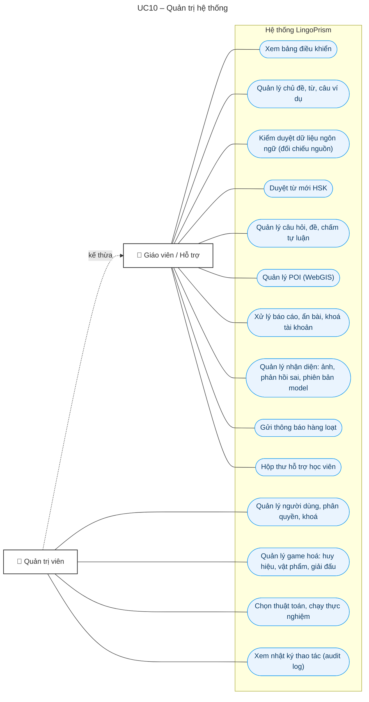
```mermaid
---
title: "UC10 – Quản trị hệ thống"
---
flowchart LR
    Staff["👤 Giáo viên / Hỗ trợ"]:::actor
    Admin["👤 Quản trị viên"]:::actor
    Admin -. kế thừa .-> Staff
    subgraph SYS["Hệ thống LingoPrism"]
        A(["Xem bảng điều khiển"]):::uc
        B(["Quản lý người dùng, phân quyền, khoá"]):::uc
        C(["Quản lý chủ đề, từ, câu ví dụ"]):::uc
        D(["Kiểm duyệt dữ liệu ngôn ngữ (đối chiếu nguồn)"]):::uc
        E(["Duyệt từ mới HSK"]):::uc
        F(["Quản lý câu hỏi, đề, chấm tự luận"]):::uc
        G(["Quản lý POI (WebGIS)"]):::uc
        H(["Xử lý báo cáo, ẩn bài, khoá tài khoản"]):::uc
        I(["Quản lý nhận diện: ảnh, phản hồi sai, phiên bản model"]):::uc
        J(["Quản lý game hoá: huy hiệu, vật phẩm, giải đấu"]):::uc
        K(["Chọn thuật toán, chạy thực nghiệm"]):::uc
        L(["Gửi thông báo hàng loạt"]):::uc
        M(["Xem nhật ký thao tác (audit log)"]):::uc
        N(["Hộp thư hỗ trợ học viên"]):::uc
    end
    Staff --- A & C & D & E & F & G & H & I & L & N
    Admin --- B & J & K & M

    classDef actor fill:#fff,stroke:#333,stroke-width:1.5px
    classDef uc fill:#eaf4fe,stroke:#1899f0,color:#0b3b66
    classDef ext fill:#f5f5f5,stroke:#888,stroke-dasharray:4 3
```

## Kiến trúc

### AR01 – Kiến trúc tổng thể

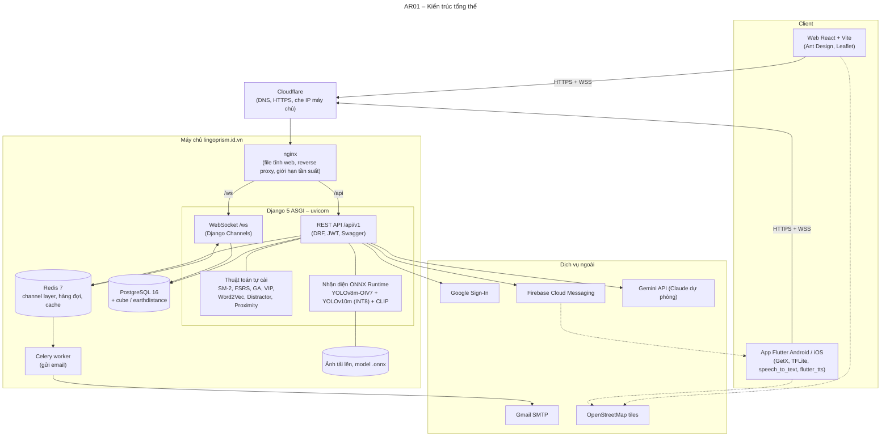
```mermaid
---
title: "AR01 – Kiến trúc tổng thể"
---
flowchart TB
    subgraph C["Client"]
        WEB["Web React + Vite<br/>(Ant Design, Leaflet)"]
        APP["App Flutter Android / iOS<br/>(GetX, TFLite, speech_to_text, flutter_tts)"]
    end
    CF["Cloudflare<br/>(DNS, HTTPS, che IP máy chủ)"]
    subgraph S["Máy chủ lingoprism.id.vn"]
        NG["nginx<br/>(file tĩnh web, reverse proxy, giới hạn tần suất)"]
        subgraph DJ["Django 5 ASGI – uvicorn"]
            REST["REST API /api/v1<br/>(DRF, JWT, Swagger)"]
            WS["WebSocket /ws<br/>(Django Channels)"]
            ALG["Thuật toán tự cài<br/>SM-2, FSRS, GA, VIP,<br/>Word2Vec, Distractor, Proximity"]
            DET["Nhận diện ONNX Runtime<br/>YOLOv8m-OIV7 + YOLOv10m (INT8) + CLIP"]
        end
        CEL["Celery worker<br/>(gửi email)"]
        PG[("PostgreSQL 16<br/>+ cube / earthdistance")]
        RD[("Redis 7<br/>channel layer, hàng đợi, cache")]
        MED[("Ảnh tải lên, model .onnx")]
    end
    subgraph X["Dịch vụ ngoài"]
        GO["Google Sign-In"]
        FCM["Firebase Cloud Messaging"]
        SMTP["Gmail SMTP"]
        GEM["Gemini API (Claude dự phòng)"]
        OSM["OpenStreetMap tiles"]
    end
    WEB & APP -->|HTTPS + WSS| CF --> NG
    NG -->|/api| REST
    NG -->|/ws| WS
    REST --- ALG & DET
    REST & WS --> PG
    WS <--> RD
    REST --> RD --> CEL --> SMTP
    DET --- MED
    REST --> GO & FCM & GEM
    FCM -.-> APP
    WEB & APP -.-> OSM
```

### AR02 – Sơ đồ triển khai (Azure VM B2als_v2: 2 vCPU, 4 GB, ufw 22/80/443, fail2ban; docker compose lingoprism-prod)

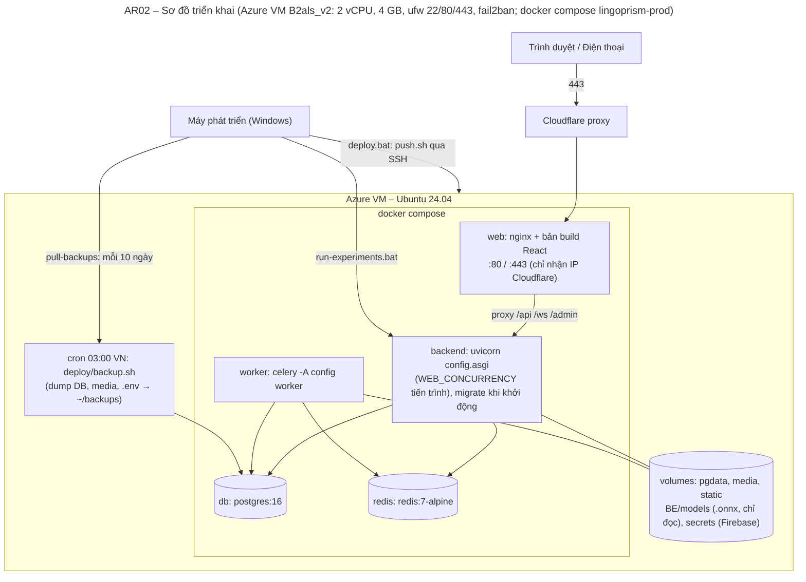
```mermaid
---
title: "AR02 – Sơ đồ triển khai (Azure VM B2als_v2: 2 vCPU, 4 GB, ufw 22/80/443, fail2ban; docker compose lingoprism-prod)"
---
flowchart TB
    U["Trình duyệt / Điện thoại"] -->|443| CF["Cloudflare proxy"]
    subgraph VM["Azure VM – Ubuntu 24.04"]
        subgraph DC["docker compose"]
            web["web: nginx + bản build React<br/>:80 / :443 (chỉ nhận IP Cloudflare)"]
            backend["backend: uvicorn config.asgi<br/>(WEB_CONCURRENCY tiến trình), migrate khi khởi động"]
            worker["worker: celery -A config worker"]
            db[("db: postgres:16")]
            redis[("redis: redis:7-alpine")]
        end
        vol[("volumes: pgdata, media, static<br/>BE/models (.onnx, chỉ đọc), secrets (Firebase)")]
        cron["cron 03:00 VN: deploy/backup.sh<br/>(dump DB, media, .env → ~/backups)"]
    end
    PC["Máy phát triển (Windows)"]
    CF --> web -->|proxy /api /ws /admin| backend
    backend --> db & redis
    worker --> redis & db
    backend & worker --- vol
    cron --> db
    PC -->|deploy.bat: push.sh qua SSH| VM
    PC -->|pull-backups: mỗi 10 ngày| cron
    PC -->|run-experiments.bat| backend
```

### AR03 – Các module của máy chủ (modular monolith, mỗi module một app Django)

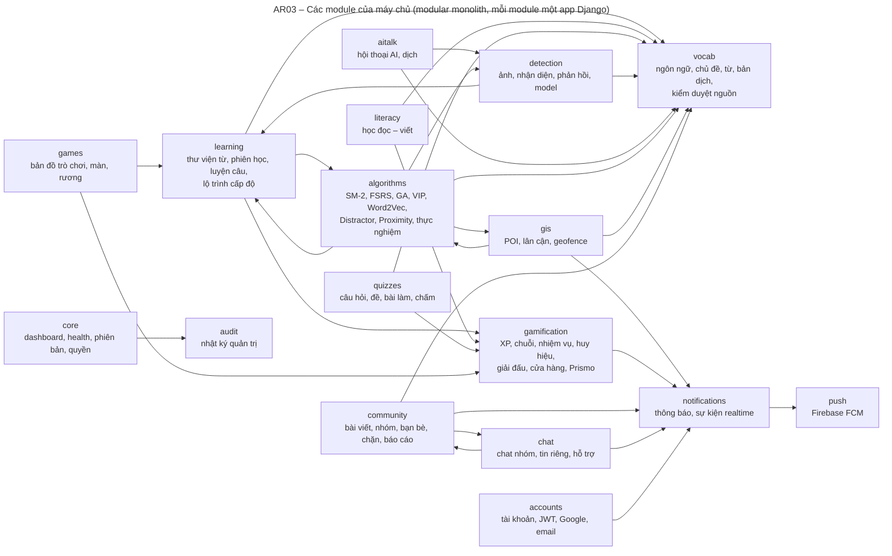
```mermaid
---
title: "AR03 – Các module của máy chủ (modular monolith, mỗi module một app Django)"
---
flowchart LR
    accounts["accounts<br/>tài khoản, JWT, Google, email"]
    vocab["vocab<br/>ngôn ngữ, chủ đề, từ, bản dịch,<br/>kiểm duyệt nguồn"]
    learning["learning<br/>thư viện từ, phiên học, luyện câu,<br/>lộ trình cấp độ"]
    literacy["literacy<br/>học đọc – viết"]
    quizzes["quizzes<br/>câu hỏi, đề, bài làm, chấm"]
    detection["detection<br/>ảnh, nhận diện, phản hồi, model"]
    aitalk["aitalk<br/>hội thoại AI, dịch"]
    algorithms["algorithms<br/>SM-2, FSRS, GA, VIP, Word2Vec,<br/>Distractor, Proximity, thực nghiệm"]
    gis["gis<br/>POI, lân cận, geofence"]
    gamification["gamification<br/>XP, chuỗi, nhiệm vụ, huy hiệu,<br/>giải đấu, cửa hàng, Prismo"]
    games["games<br/>bản đồ trò chơi, màn, rương"]
    community["community<br/>bài viết, nhóm, bạn bè, chặn, báo cáo"]
    chat["chat<br/>chat nhóm, tin riêng, hỗ trợ"]
    notifications["notifications<br/>thông báo, sự kiện realtime"]
    push["push<br/>Firebase FCM"]
    audit["audit<br/>nhật ký quản trị"]
    core["core<br/>dashboard, health, phiên bản, quyền"]

    learning --> vocab & algorithms & gamification
    literacy --> vocab & gamification
    quizzes --> vocab & gamification
    detection --> vocab & learning
    aitalk --> detection & vocab
    algorithms --> learning & detection & gis & vocab
    gis --> vocab & notifications & algorithms
    games --> learning & gamification
    gamification --> notifications
    community --> chat & notifications & vocab
    chat --> community & notifications
    notifications --> push
    accounts --> notifications
    core --> audit
```

### AR04 – Kiến trúc realtime (Django Channels + Redis)

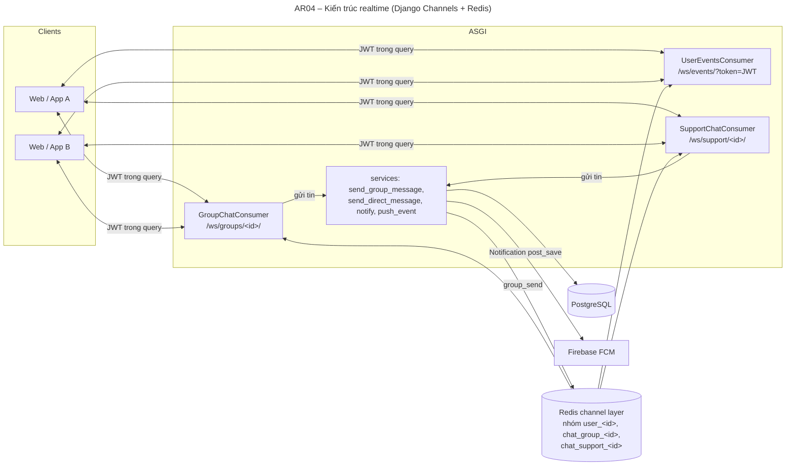
```mermaid
---
title: "AR04 – Kiến trúc realtime (Django Channels + Redis)"
---
flowchart LR
    subgraph Clients
        A1["Web / App A"]
        A2["Web / App B"]
    end
    subgraph Server["ASGI"]
        E["UserEventsConsumer<br/>/ws/events/?token=JWT"]
        G["GroupChatConsumer<br/>/ws/groups/&lt;id&gt;/"]
        S["SupportChatConsumer<br/>/ws/support/&lt;id&gt;/"]
        SV["services: send_group_message,<br/>send_direct_message, notify, push_event"]
    end
    R[("Redis channel layer<br/>nhóm user_&lt;id&gt;, chat_group_&lt;id&gt;,<br/>chat_support_&lt;id&gt;")]
    DB[("PostgreSQL")]
    FCM["Firebase FCM"]
    A1 & A2 <-->|JWT trong query| E & G & S
    G & S -->|gửi tin| SV --> DB
    SV -->|group_send| R --> E & G & S
    SV -->|Notification post_save| FCM
```

### AR05 – Đường ống nhận diện ảnh

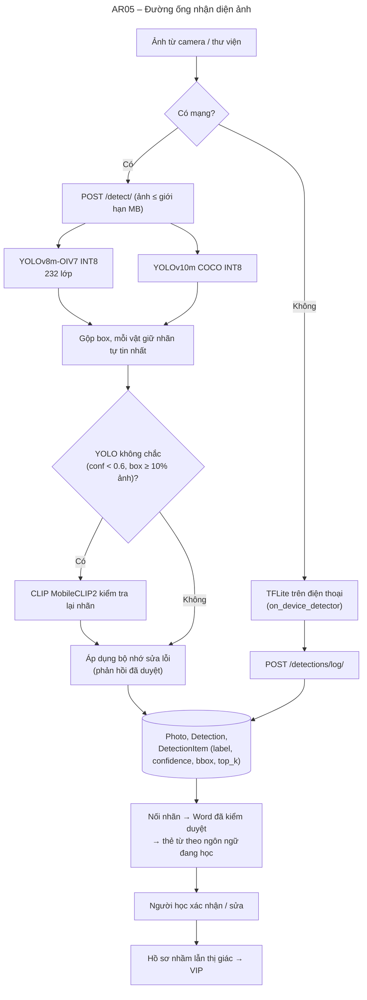
```mermaid
---
title: "AR05 – Đường ống nhận diện ảnh"
---
flowchart TB
    IMG["Ảnh từ camera / thư viện"] --> MODE{"Có mạng?"}
    MODE -- Không --> TFL["TFLite trên điện thoại<br/>(on_device_detector)"] --> LOG["POST /detections/log/"]
    MODE -- Có --> UP["POST /detect/ (ảnh ≤ giới hạn MB)"]
    UP --> Y1["YOLOv8m-OIV7 INT8<br/>232 lớp"] & Y2["YOLOv10m COCO INT8"]
    Y1 & Y2 --> MERGE["Gộp box, mỗi vật giữ nhãn tự tin nhất"]
    MERGE --> CLIP{"YOLO không chắc<br/>(conf &lt; 0.6, box ≥ 10% ảnh)?"}
    CLIP -- Có --> V["CLIP MobileCLIP2 kiểm tra lại nhãn"] --> MEM
    CLIP -- Không --> MEM["Áp dụng bộ nhớ sửa lỗi<br/>(phản hồi đã duyệt)"]
    MEM --> SAVE[("Photo, Detection,<br/>DetectionItem (label, confidence, bbox, top_k)")]
    LOG --> SAVE
    SAVE --> WORDS["Nối nhãn → Word đã kiểm duyệt<br/>→ thẻ từ theo ngôn ngữ đang học"]
    WORDS --> FB["Người học xác nhận / sửa"] --> VIP["Hồ sơ nhầm lẫn thị giác → VIP"]
```

## Activity

### A01 – Đăng ký và xác minh email

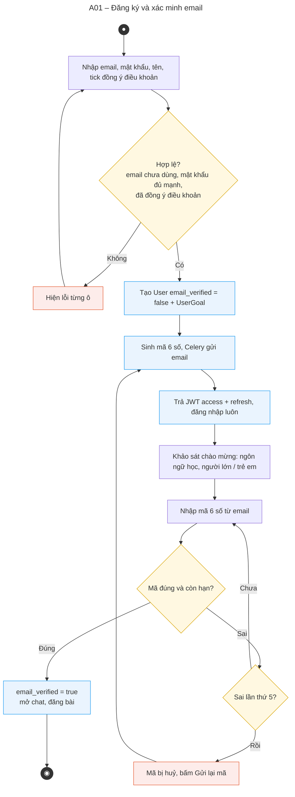
```mermaid
---
title: "A01 – Đăng ký và xác minh email"
---
flowchart TD
    S((●)):::se
    E((◉)):::se

    S --> A["Nhập email, mật khẩu, tên, tick đồng ý điều khoản"]
    A --> B{"Hợp lệ?<br/>email chưa dùng, mật khẩu đủ mạnh,<br/>đã đồng ý điều khoản"}:::dec
    B -- Không --> B1["Hiện lỗi từng ô"]:::err --> A
    B -- Có --> C["Tạo User email_verified = false + UserGoal"]:::sys
    C --> D["Sinh mã 6 số, Celery gửi email"]:::sys
    D --> F["Trả JWT access + refresh, đăng nhập luôn"]:::sys
    F --> G["Khảo sát chào mừng: ngôn ngữ học, người lớn / trẻ em"]
    G --> H["Nhập mã 6 số từ email"]
    H --> I{"Mã đúng và còn hạn?"}:::dec
    I -- Sai --> I1{"Sai lần thứ 5?"}:::dec
    I1 -- Chưa --> H
    I1 -- Rồi --> J["Mã bị huỷ, bấm Gửi lại mã"]:::err --> D
    I -- Đúng --> K["email_verified = true<br/>mở chat, đăng bài"]:::sys --> E
    classDef se fill:#333,stroke:#333,color:#fff
    classDef dec fill:#fff8e1,stroke:#d9a400
    classDef sys fill:#eaf4fe,stroke:#1899f0
    classDef err fill:#fdecea,stroke:#e4572e
```

### A02 – Đăng nhập (mật khẩu hoặc Google)

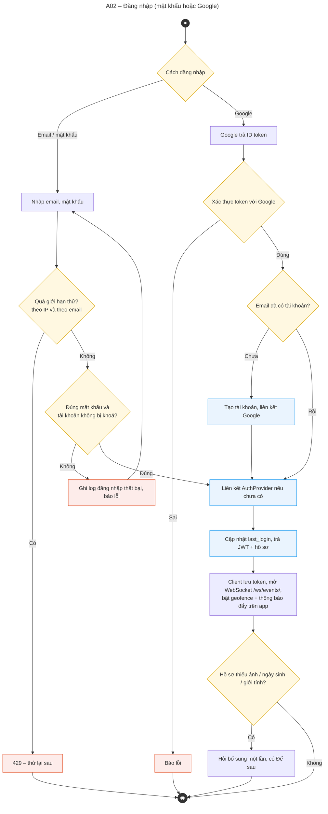
```mermaid
---
title: "A02 – Đăng nhập (mật khẩu hoặc Google)"
---
flowchart TD
    S((●)):::se
    E((◉)):::se

    S --> A{"Cách đăng nhập"}:::dec
    A -- Email / mật khẩu --> B["Nhập email, mật khẩu"]
    B --> C{"Quá giới hạn thử?<br/>theo IP và theo email"}:::dec
    C -- Có --> C1["429 – thử lại sau"]:::err --> E
    C -- Không --> D{"Đúng mật khẩu và<br/>tài khoản không bị khoá?"}:::dec
    D -- Không --> D1["Ghi log đăng nhập thất bại, báo lỗi"]:::err --> B
    A -- Google --> G["Google trả ID token"]
    G --> H{"Xác thực token với Google"}:::dec
    H -- Sai --> H1["Báo lỗi"]:::err --> E
    H -- Đúng --> I{"Email đã có tài khoản?"}:::dec
    I -- Chưa --> J["Tạo tài khoản, liên kết Google"]:::sys --> K
    I -- Rồi --> K["Liên kết AuthProvider nếu chưa có"]:::sys
    D -- Đúng --> K
    K --> L["Cập nhật last_login, trả JWT + hồ sơ"]:::sys
    L --> M["Client lưu token, mở WebSocket /ws/events/,<br/>bật geofence + thông báo đẩy trên app"]
    M --> N{"Hồ sơ thiếu ảnh / ngày sinh / giới tính?"}:::dec
    N -- Có --> N1["Hỏi bổ sung một lần, có Để sau"] --> E
    N -- Không --> E
    classDef se fill:#333,stroke:#333,color:#fff
    classDef dec fill:#fff8e1,stroke:#d9a400
    classDef sys fill:#eaf4fe,stroke:#1899f0
    classDef err fill:#fdecea,stroke:#e4572e
```

### A03 – Quên và đặt lại mật khẩu

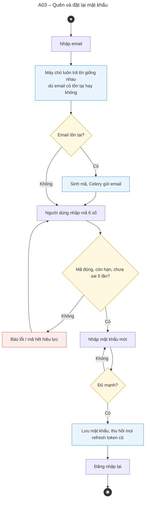
```mermaid
---
title: "A03 – Quên và đặt lại mật khẩu"
---
flowchart TD
    S((●)):::se
    E((◉)):::se

    S --> A["Nhập email"]
    A --> B["Máy chủ luôn trả lời giống nhau<br/>dù email có tồn tại hay không"]:::sys
    B --> C{"Email tồn tại?"}:::dec
    C -- Có --> D["Sinh mã, Celery gửi email"]:::sys --> F
    C -- Không --> F["Người dùng nhập mã 6 số"]
    F --> G{"Mã đúng, còn hạn, chưa sai 5 lần?"}:::dec
    G -- Không --> G1["Báo lỗi / mã hết hiệu lực"]:::err --> F
    G -- Có --> H["Nhập mật khẩu mới"]
    H --> I{"Đủ mạnh?"}:::dec
    I -- Không --> H
    I -- Có --> J["Lưu mật khẩu, thu hồi mọi refresh token cũ"]:::sys --> K["Đăng nhập lại"] --> E
    classDef se fill:#333,stroke:#333,color:#fff
    classDef dec fill:#fff8e1,stroke:#d9a400
    classDef sys fill:#eaf4fe,stroke:#1899f0
    classDef err fill:#fdecea,stroke:#e4572e
```

### A04 – Duyệt chủ đề và lưu từ

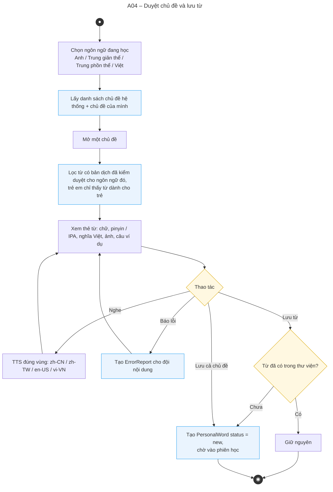
```mermaid
---
title: "A04 – Duyệt chủ đề và lưu từ"
---
flowchart TD
    S((●)):::se
    E((◉)):::se

    S --> A["Chọn ngôn ngữ đang học<br/>Anh / Trung giản thể / Trung phồn thể / Việt"]
    A --> B["Lấy danh sách chủ đề hệ thống + chủ đề của mình"]:::sys
    B --> C["Mở một chủ đề"]
    C --> D["Lọc từ có bản dịch đã kiểm duyệt cho ngôn ngữ đó,<br/>trẻ em chỉ thấy từ dành cho trẻ"]:::sys
    D --> F["Xem thẻ từ: chữ, pinyin / IPA, nghĩa Việt, ảnh, câu ví dụ"]
    F --> G{"Thao tác"}:::dec
    G -- Nghe --> H["TTS đúng vùng: zh-CN / zh-TW / en-US / vi-VN"] --> F
    G -- Báo lỗi --> I["Tạo ErrorReport cho đội nội dung"]:::sys --> F
    G -- Lưu từ --> J{"Từ đã có trong thư viện?"}:::dec
    J -- Có --> K["Giữ nguyên"] --> E
    J -- Chưa --> L["Tạo PersonalWord status = new,<br/>chờ vào phiên học"]:::sys --> E
    G -- Lưu cả chủ đề --> L
    classDef se fill:#333,stroke:#333,color:#fff
    classDef dec fill:#fff8e1,stroke:#d9a400
    classDef sys fill:#eaf4fe,stroke:#1899f0
    classDef err fill:#fdecea,stroke:#e4572e
```

### A05 – Phiên học từ mới / ôn tập (SRS + VIP + Smart Distractor)

```mermaid
---
title: "A05 – Phiên học từ mới / ôn tập (SRS + VIP + Smart Distractor)"
---
flowchart TD
    S((●)):::se
    E((◉)):::se

    S --> A{"Loại phiên"}:::dec
    A -- Học mới --> B["Lấy từ status new theo cấp độ / chủ đề,<br/>thiếu thì bổ sung từ lộ trình"]:::sys
    A -- Ôn tập --> C["Lấy từ đến hạn due_at ≤ bây giờ"]:::sys
    C --> D{"Thứ tự ôn = VIP?"}:::dec
    D -- Có --> D1["Xếp theo điểm VIP: quên + độ khó<br/>+ độ không chắc nhận diện + nhầm lẫn thị giác"]:::sys --> F
    D -- Không --> D2["Xếp theo hạn ôn"] --> F
    B --> F{"Có từ nào?"}:::dec
    F -- Không --> F1["Báo chưa có từ đến hạn / để học"]:::err --> E
    F -- Có --> G["Tạo StudySession, ghi bộ lập lịch đang dùng<br/>SM-2 hoặc FSRS + tham số GA"]:::sys
    G --> H["Sinh câu hỏi cho mỗi từ,<br/>đáp án nhiễu bằng Smart Distractor / ngẫu nhiên"]:::sys
    H --> I["Học viên trả lời một câu"]
    I --> J["Tính rating: đúng lần đầu = 4, đúng sau khi sai = 3, sai = 1"]:::sys
    J --> K["Bộ lập lịch cập nhật trạng thái + hạn ôn mới"]:::sys
    K --> L["Ghi ReviewLog: trạng thái trước / sau, thời gian trả lời"]:::sys
    L --> M{"Còn câu?"}:::dec
    M -- Còn --> I
    M -- Hết --> N["Kết thúc phiên: XP = 5 × số câu + 5 × số đúng lần đầu"]:::sys
    N --> O["Cộng XP có hệ số tăng tốc, trần XP ngày,<br/>chuỗi ngày, nhiệm vụ, vảy, huy hiệu, giải tuần"]:::sys
    O --> P{"Đủ % để mở cấp tiếp?"}:::dec
    P -- Có --> P1["Lên cấp"] --> Q
    P -- Không --> Q["Hiện kết quả + từ cần luyện thêm"] --> E
    classDef se fill:#333,stroke:#333,color:#fff
    classDef dec fill:#fff8e1,stroke:#d9a400
    classDef sys fill:#eaf4fe,stroke:#1899f0
    classDef err fill:#fdecea,stroke:#e4572e
```

### A06 – Luyện câu

```mermaid
---
title: "A06 – Luyện câu"
---
flowchart TD
    S((●)):::se
    E((◉)):::se

    S --> A["Yêu cầu một bài luyện câu"]
    A --> B["Chọn câu ví dụ đã kiểm duyệt (Tatoeba)<br/>chứa từ học viên đang học"]:::sys
    B --> C{"Có câu phù hợp?"}:::dec
    C -- Không --> C1["Báo cần học thêm từ"] --> E
    C -- Có --> D["Tạo bài: sắp xếp câu, nghe – sắp xếp,<br/>điền từ, chọn nghĩa (nghĩa luôn bằng tiếng Việt)"]:::sys
    D --> F["Học viên làm một bài"]
    F --> G["Máy chủ chấm: so khớp chuẩn hoá,<br/>tiếng Trung so từng chữ"]:::sys
    G --> H{"Đúng?"}:::dec
    H -- Có --> I["Cộng XP luyện tập, đánh dấu hoạt động"]:::sys --> J
    H -- Sai --> I2["Hiện đáp án đúng + bản dịch"] --> J
    J{"Còn bài?"}:::dec
    J -- Còn --> F
    J -- Hết --> E
    classDef se fill:#333,stroke:#333,color:#fff
    classDef dec fill:#fff8e1,stroke:#d9a400
    classDef sys fill:#eaf4fe,stroke:#1899f0
    classDef err fill:#fdecea,stroke:#e4572e
```

### A07 – Luyện phát âm

```mermaid
---
title: "A07 – Luyện phát âm"
---
flowchart TD
    S((●)):::se
    E((◉)):::se

    S --> A["Lấy tối đa 10 từ trong thư viện có giọng đọc"]
    A --> B{"Thiết bị nhận dạng được giọng nói?"}:::dec
    B -- Không --> B1["Hướng dẫn dùng Chrome / Edge / app"] --> E
    B -- Có --> C["Nghe giọng mẫu (TTS đúng vùng)"]
    C --> D["Bấm mic, đọc to từ"]
    D --> F["Bộ nhận dạng của thiết bị trả các phương án nghe được"]
    F --> G["So với từ mẫu: tiếng Trung theo chữ,<br/>ngôn ngữ khác theo chữ cái (Levenshtein)"]
    G --> H["Điểm 0–100, tô đỏ phần đọc chưa đúng"]
    H --> I{"Đọc lại?"}:::dec
    I -- Có --> D
    I -- Không --> J{"Còn từ?"}:::dec
    J -- Còn --> C
    J -- Hết --> K["Điểm trung bình của lượt"] --> E
    classDef se fill:#333,stroke:#333,color:#fff
    classDef dec fill:#fff8e1,stroke:#d9a400
    classDef sys fill:#eaf4fe,stroke:#1899f0
    classDef err fill:#fdecea,stroke:#e4572e
```

### A08 – Học đọc – viết tiếng Việt (trẻ em)

```mermaid
---
title: "A08 – Học đọc – viết tiếng Việt (trẻ em)"
---
flowchart TD
    S((●)):::se
    E((◉)):::se

    S --> A["Mở lộ trình bài học đọc – viết"]
    A --> B["Máy chủ tính bài cao nhất được mở<br/>(giáo viên mở được tất cả)"]:::sys
    B --> C["Chọn một bài đã mở"]
    C --> D{"Bài được mở?"}:::dec
    D -- Không --> D1["Khoá, học bài trước"] --> A
    D -- Có --> F["Học âm, vần, ghép chữ, nghe đọc"]
    F --> G["Làm bài tập: chọn, ghép, gõ có dấu"]
    G --> H["POST /literacy/check: chấm từng câu"]:::sys
    H --> I{"Còn câu?"}:::dec
    I -- Còn --> G
    I -- Hết --> J["POST /literacy/lessons/n/finish"]:::sys
    J --> K{"Đạt ≥ 60%?"}:::dec
    K -- Có --> K1["Lưu tiến độ, cộng XP, mở bài tiếp theo"]:::sys --> E
    K -- Không --> K2["Lưu điểm tốt nhất, học lại"]:::sys --> E
    classDef se fill:#333,stroke:#333,color:#fff
    classDef dec fill:#fff8e1,stroke:#d9a400
    classDef sys fill:#eaf4fe,stroke:#1899f0
    classDef err fill:#fdecea,stroke:#e4572e
```

### A09 – Kiểm tra vượt cấp độ

```mermaid
---
title: "A09 – Kiểm tra vượt cấp độ"
---
flowchart TD
    S((●)):::se
    E((◉)):::se

    S --> A["Chọn cấp muốn vượt"]
    A --> B["GET /levels/n/test: 10 câu + token ký số"]:::sys
    B --> C["Làm 10 câu"]
    C --> D["POST đáp án + token"]
    D --> F{"Token hợp lệ và đúng người, đúng cấp?"}:::dec
    F -- Không --> F1["Báo đề hết hạn"] --> E
    F -- Có --> G{"Đúng ≥ 8 câu?"}:::dec
    G -- Có --> H["Mở cấp tiếp theo, chuyển sang cấp đó"]:::sys --> E
    G -- Không --> I["Giữ cấp hiện tại, gợi ý ôn thêm"] --> E
    classDef se fill:#333,stroke:#333,color:#fff
    classDef dec fill:#fff8e1,stroke:#d9a400
    classDef sys fill:#eaf4fe,stroke:#1899f0
    classDef err fill:#fdecea,stroke:#e4572e
```

### A10 – Làm bài kiểm tra và chấm tự luận

```mermaid
---
title: "A10 – Làm bài kiểm tra và chấm tự luận"
---
flowchart TD
    S((●)):::se
    E((◉)):::se

    S --> A["Học viên chọn đề"]
    A --> B["POST /exams/id/start: tạo Submission in_progress"]:::sys
    B --> C["Làm bài: trắc nghiệm, điền từ, tự luận"]
    C --> D["POST /submissions/id/submit"]
    D --> F{"Đã nộp trước đó?"}:::dec
    F -- Rồi --> F1["Báo bài đã nộp"]:::err --> E
    F -- Chưa --> G["Chấm từng câu"]:::sys
    G --> G1["Trắc nghiệm: so phương án đúng<br/>Điền từ: so tập đáp án chấp nhận sau chuẩn hoá<br/>Tự luận: để trống = 0 điểm, có viết = chờ chấm"]:::sys
    G1 --> H{"Còn câu tự luận chờ chấm?"}:::dec
    H -- Không --> I["Trạng thái graded, cộng XP theo %"]:::sys --> R
    H -- Có --> J["Trạng thái submitted – chờ giáo viên"]:::sys
    J --> K["Giáo viên mở bài, cho điểm + nhận xét từng câu"]
    K --> L{"Điểm ≤ điểm tối đa?"}:::dec
    L -- Không --> K
    L -- Có --> M["Tính lại tổng, trạng thái graded"]:::sys
    M --> N["Thông báo cho học viên: Bài đã được chấm"]:::sys --> R
    R["Học viên xem kết quả, đáp án, nhận xét"] --> E
    classDef se fill:#333,stroke:#333,color:#fff
    classDef dec fill:#fff8e1,stroke:#d9a400
    classDef sys fill:#eaf4fe,stroke:#1899f0
    classDef err fill:#fdecea,stroke:#e4572e
```

### A11 – Chụp ảnh nhận diện và lưu từ

```mermaid
---
title: "A11 – Chụp ảnh nhận diện và lưu từ"
---
flowchart TD
    S((●)):::se
    E((◉)):::se

    S --> A["Chụp hoặc chọn ảnh"]
    A --> B{"Có mạng?"}:::dec
    B -- Không --> C["Nhận diện bằng TFLite trên máy"]
    C --> C1["Lưu tạm, gửi /detections/log khi có mạng"]:::sys --> H
    B -- Có --> D{"Ảnh quá dung lượng / quá tần suất?"}:::dec
    D -- Có --> D1["Báo lỗi"]:::err --> E
    D -- Không --> F["Máy chủ: OIV7 + COCO INT8,<br/>CLIP kiểm tra box không chắc,<br/>áp dụng bộ nhớ sửa lỗi"]:::sys
    F --> G["Lưu Photo, Detection, DetectionItem<br/>(nhãn, độ tin, khung, top-k)"]:::sys
    G --> H["Nối nhãn → từ đã kiểm duyệt, hiện thẻ từ theo ngôn ngữ học"]
    H --> I{"Mỗi vật: đúng không?"}:::dec
    I -- Đúng --> J["feedback = correct"]
    I -- Sai, chọn vật khác --> K["corrected_label, feedback = wrong"]
    I -- Không phải vật --> L["Báo không có vật này"]
    I -- Gõ tên tiếng Việt --> M["Tra từ điển đã kiểm duyệt → từ đúng"]
    J & K & L & M --> N["Chọn từ muốn lưu, POST /detections/id/confirm"]
    N --> O["Lưu phản hồi, tạo PersonalWord source = camera"]:::sys
    O --> O2["Vật bị báo sai: nhúng vùng ảnh (MobileNetV3)<br/>vào bộ nhớ sửa lỗi – áp dụng ngay cho người báo"]:::sys
    O2 --> P["Nhiệm vụ Lưu từ, hồ sơ nhầm lẫn thị giác cho VIP"]:::sys
    P --> Q{"Tạo hội thoại AI từ ảnh?"}:::dec
    Q -- Có --> Q1["Xem A12"] --> E
    Q -- Không --> E
    classDef se fill:#333,stroke:#333,color:#fff
    classDef dec fill:#fff8e1,stroke:#d9a400
    classDef sys fill:#eaf4fe,stroke:#1899f0
    classDef err fill:#fdecea,stroke:#e4572e
```

### A12 – Hội thoại AI từ ảnh

```mermaid
---
title: "A12 – Hội thoại AI từ ảnh"
---
flowchart TD
    S((●)):::se
    E((◉)):::se

    S --> A["Bấm Tạo hội thoại với các từ này"]
    A --> B{"Máy chủ đã bật AI?"}:::dec
    B -- Không --> B1["Ẩn nút"] --> E
    B -- Có --> C{"Ảnh đã có hội thoại cho ngôn ngữ này?"}:::dec
    C -- Có --> C1["Trả hội thoại đã lưu, không gọi AI"] --> K
    C -- Chưa --> D["Lấy các từ đã kiểm duyệt trong ảnh<br/>(vật được chọn, nhãn đã sửa)"]:::sys
    D --> F{"Có từ nào?"}:::dec
    F -- Không --> F1["Báo ảnh chưa có từ kiểm duyệt"]:::err --> E
    F -- Có --> G["Gọi Gemini (Claude dự phòng): 4–6 câu,<br/>dùng đủ các từ, hợp trẻ em, đúng bộ chữ"]:::sys
    G --> H{"AI trả JSON hợp lệ?"}:::dec
    H -- Không --> H1["Báo AI đang bận / thử lại"]:::err --> E
    H -- Có --> I["Máy chủ tự tính pinyin (pypinyin + CC-CEDICT)"]:::sys
    I --> J["Lưu PhotoDialogue"]:::sys --> K["Hiện hội thoại, nhãn AI tạo, nghe từng câu"] --> E
    classDef se fill:#333,stroke:#333,color:#fff
    classDef dec fill:#fff8e1,stroke:#d9a400
    classDef sys fill:#eaf4fe,stroke:#1899f0
    classDef err fill:#fdecea,stroke:#e4572e
```

### A13 – Dịch văn bản / giọng nói (trang Dịch và trong chat)

```mermaid
---
title: "A13 – Dịch văn bản / giọng nói (trang Dịch và trong chat)"
---
flowchart TD
    S((●)):::se
    E((◉)):::se

    S --> A{"Nhập bằng"}:::dec
    A -- Gõ --> C["Văn bản ≤ 500 ký tự"]
    A -- Nói --> B["Nhận dạng giọng nói trên thiết bị<br/>theo ngôn ngữ đã chọn"] --> C
    C --> D{"Cặp ngôn ngữ hợp lệ?<br/>khác nhau, không giản ↔ phồn"}:::dec
    D -- Không --> D1["Báo lỗi"]:::err --> E
    D -- Có --> F{"Quá 120 lần / giờ?"}:::dec
    F -- Có --> F1["429"]:::err --> E
    F -- Không --> G["Gemini flash-lite dịch<br/>(nguồn auto: tự nhận ngôn ngữ)"]:::sys
    G --> H{"Bản dịch tiếng Trung đúng bộ chữ?<br/>(đối chiếu CC-CEDICT)"}:::dec
    H -- Sai --> H1["Từ chối, báo không dịch được"]:::err --> E
    H -- Đúng --> I["Tính pinyin, tìm từ đã kiểm duyệt trong câu"]:::sys
    I --> J{"Đang ở đâu?"}:::dec
    J -- Trang Dịch --> K["Hiện bản dịch máy, nghe, chép,<br/>Lưu từ đã kiểm duyệt"] --> E
    J -- Ô chat --> L["Thay chữ trong ô bằng bản dịch,<br/>hiện pinyin + Hoàn tác"] --> M["Gửi tin như bình thường"] --> E
    classDef se fill:#333,stroke:#333,color:#fff
    classDef dec fill:#fff8e1,stroke:#d9a400
    classDef sys fill:#eaf4fe,stroke:#1899f0
    classDef err fill:#fdecea,stroke:#e4572e
```

### A14 – Học theo vị trí: bản đồ và geofence

```mermaid
---
title: "A14 – Học theo vị trí: bản đồ và geofence"
---
flowchart TD
    S((●)):::se
    E((◉)):::se

    S --> A{"Cách dùng"}:::dec
    A -- Mở bản đồ --> B["Lấy vị trí hiện tại, chọn bán kính"]
    B --> C["GET /pois-nearby: chỉ mục lưới + Haversine"]:::sys
    C --> D["Hiện POI trên bản đồ"] --> F["Chạm POI → chủ đề → học"] --> E
    A -- Tự động (app đang mở) --> G["Nhận vị trí sau mỗi 25 m"]
    G --> H{"Lần kiểm tra trước đã quá 15 giây?"}:::dec
    H -- Chưa --> G
    H -- Rồi --> I["POST /geofence/check"]
    I --> J["Tìm POI có d ≤ bán kính POI"]:::sys
    J --> K{"Có POI?"}:::dec
    K -- Không --> G
    K -- Có --> L["Ghi GeofenceEvent"]:::sys
    L --> M{"Đã báo POI này trong 6 giờ qua<br/>hoặc tắt gợi ý vị trí<br/>hoặc POI chưa gắn chủ đề?"}:::dec
    M -- Có --> G
    M -- Không --> N["Tạo thông báo: Bạn đang ở gần … học ngay chủ đề …"]:::sys
    N --> O["Banner trong app + thông báo đẩy"]
    O --> P{"Học viên bấm?"}:::dec
    P -- Có --> F
    P -- Không --> G
    classDef se fill:#333,stroke:#333,color:#fff
    classDef dec fill:#fff8e1,stroke:#d9a400
    classDef sys fill:#eaf4fe,stroke:#1899f0
    classDef err fill:#fdecea,stroke:#e4572e
```

### A15 – Trò chơi

```mermaid
---
title: "A15 – Trò chơi"
---
flowchart TD
    S((●)):::se
    E((◉)):::se

    S --> A["Mở bản đồ trò chơi của ngôn ngữ đang học"]
    A --> B["Máy chủ dựng bản đồ: các màn, màn trùm, rương,<br/>vị trí bạn bè"]:::sys
    B --> C{"Chọn"}:::dec
    C -- Rương --> R["POST mở rương: thưởng một lần"] --> A
    C -- Màn chơi --> D["GET màn: câu hỏi từ từ đã học + token ký số"]:::sys
    D --> F["Chơi các vòng trên thiết bị"]
    F --> G{"Dùng trợ giúp?"}:::dec
    G -- Có --> G1{"Đủ vảy, chưa quá 3 lần / loại?"}:::dec
    G1 -- Có --> G2["Trừ vảy, hiện gợi ý / làm lại câu"] --> F
    G1 -- Không --> F
    G -- Không --> H["POST kết quả + token"]
    H --> I{"Token đúng người, đúng màn, đúng ngôn ngữ<br/>và kết quả khớp số câu?"}:::dec
    I -- Không --> I1["Từ chối"]:::err --> E
    I -- Có --> J["Tính % đúng, số sao"]:::sys
    J --> K{"Qua màn lần đầu?"}:::dec
    K -- Có --> K1["Cộng XP (trùm: thêm ngọc), huy hiệu trò chơi"]:::sys --> L
    K -- Không --> L["Lưu sao tốt nhất, nhiệm vụ Thắng màn"]:::sys
    L --> M{"Qua màn?"}:::dec
    M -- Có --> M1["Gợi ý màn tiếp theo"] --> E
    M -- Không --> M2["Hiện câu sai để ôn"] --> E
    classDef se fill:#333,stroke:#333,color:#fff
    classDef dec fill:#fff8e1,stroke:#d9a400
    classDef sys fill:#eaf4fe,stroke:#1899f0
    classDef err fill:#fdecea,stroke:#e4572e
```

### A16 – Nhiệm vụ, huy hiệu, cửa hàng và giải đấu tuần

```mermaid
---
title: "A16 – Nhiệm vụ, huy hiệu, cửa hàng và giải đấu tuần"
---
flowchart TD
    S((●)):::se
    E((◉)):::se

    S --> A["Học, chơi, lưu từ, làm bài…"]
    A --> B["Cộng tiến độ nhiệm vụ ngày / tháng, kiểm tra huy hiệu"]:::sys
    B --> C{"Nhiệm vụ đạt?"}:::dec
    C -- Có --> D["Bấm Nhận: cộng XP / vảy, một lần"]:::sys --> F
    C -- Chưa --> F{"Vào cửa hàng?"}:::dec
    F -- Có --> G["Chọn vật phẩm"]
    G --> H{"Đủ vảy / ngọc, chưa sở hữu<br/>(với đồ dùng một lần)?"}:::dec
    H -- Không --> H1["Báo không đủ"]:::err --> F
    H -- Có --> I["Trừ tiền, thêm vào kho"]:::sys
    I --> J{"Loại"}:::dec
    J -- Tăng tốc XP --> J1["Dùng: bật hệ số XP có thời hạn"]:::sys --> K
    J -- Đóng băng chuỗi --> J2["Tự dùng khi lỡ đúng một ngày, giữ chuỗi"]:::sys --> K
    J -- Sticker / đồ Prismo --> J3["Dùng trong chat / thay đồ"]:::sys --> K
    F -- Không --> K["XP vào giải đấu tuần theo hạng"]
    K --> L["Cuối tuần: đóng giải, lên / xuống hạng, thưởng"]:::sys --> E
    classDef se fill:#333,stroke:#333,color:#fff
    classDef dec fill:#fff8e1,stroke:#d9a400
    classDef sys fill:#eaf4fe,stroke:#1899f0
    classDef err fill:#fdecea,stroke:#e4572e
```

### A17 – Cộng đồng: đăng bài, bình luận, lưu từ trong bài

```mermaid
---
title: "A17 – Cộng đồng: đăng bài, bình luận, lưu từ trong bài"
---
flowchart TD
    S((●)):::se
    E((◉)):::se

    S --> A["Xem bảng tin"]
    A --> B{"Thao tác"}:::dec
    B -- Đăng bài --> C{"Email đã xác minh, không quá giới hạn tải lên?"}:::dec
    C -- Không --> C1["Báo lỗi"]:::err --> A
    C -- Có --> D["Lưu bài + ảnh, có thể kèm từ vựng"]:::sys --> A
    B -- Thích / lưu bài --> F["Bật / tắt"]:::sys --> A
    B -- Bình luận --> G["Lưu bình luận, thông báo chủ bài"]:::sys --> A
    B -- Lưu từ trong bài --> H["Thêm các từ đã kiểm duyệt vào thư viện"]:::sys --> A
    B -- Báo cáo bài --> I["Tạo PostReport cho kiểm duyệt"]:::sys --> A
    B -- Thoát --> E
    classDef se fill:#333,stroke:#333,color:#fff
    classDef dec fill:#fff8e1,stroke:#d9a400
    classDef sys fill:#eaf4fe,stroke:#1899f0
    classDef err fill:#fdecea,stroke:#e4572e
```

### A18 – Bạn bè, theo dõi, chặn và báo cáo người dùng

```mermaid
---
title: "A18 – Bạn bè, theo dõi, chặn và báo cáo người dùng"
---
flowchart TD
    S((●)):::se
    E((◉)):::se

    S --> A{"Là tài khoản trẻ em?"}:::dec
    A -- Có --> A1["Không dùng được tính năng xã hội"] --> E
    A -- Không --> B["Tìm bằng tên hoặc ID 8 số / gợi ý"]
    B --> C{"Thao tác"}:::dec
    C -- Theo dõi --> D["Theo dõi / bỏ theo dõi"]:::sys --> E
    C -- Kết bạn --> F["Gửi lời mời, thông báo người kia"]:::sys
    F --> G{"Người kia"}:::dec
    G -- Đồng ý --> G1["Thành bạn bè: nhắn tin được"]:::sys --> E
    G -- Từ chối --> E
    C -- Chặn --> H["Chặn: huỷ theo dõi, bạn bè, ẩn bài, cấm nhắn"]:::sys --> E
    C -- Báo cáo --> I{"Đã có báo cáo đang chờ?"}:::dec
    I -- Có --> I1["Báo đã gửi trước đó"] --> E
    I -- Không --> J["Tạo UserReport, kèm 30 tin nhắn cuối làm bằng chứng"]:::sys
    J --> K{"Chặn luôn?"}:::dec
    K -- Có --> H
    K -- Không --> E
    classDef se fill:#333,stroke:#333,color:#fff
    classDef dec fill:#fff8e1,stroke:#d9a400
    classDef sys fill:#eaf4fe,stroke:#1899f0
    classDef err fill:#fdecea,stroke:#e4572e
```

### A19 – Nhóm học và chat nhóm realtime

```mermaid
---
title: "A19 – Nhóm học và chat nhóm realtime"
---
flowchart TD
    S((●)):::se
    E((◉)):::se

    S --> A["Chọn nhóm, bấm Tham gia"]
    A --> B{"Nhóm cần duyệt?"}:::dec
    B -- Có --> C["Thành viên pending, báo trưởng nhóm"]:::sys
    C --> D{"Trưởng nhóm duyệt?"}:::dec
    D -- Không --> E
    D -- Có --> F
    B -- Không --> F["Thành viên active, báo trưởng nhóm"]:::sys
    F --> G["Mở WebSocket /ws/groups/id (JWT)"]
    G --> H{"Là thành viên active, không phải trẻ em,<br/>email đã xác minh?"}:::dec
    H -- Không --> H1["Đóng kết nối 4403"]:::err --> E
    H -- Có --> I["Soạn tin: gõ / Nói / Dịch, sticker, khoe huy hiệu"]
    I --> J{"Quá 8 tin liên tiếp (1 tin / giây)?"}:::dec
    J -- Có --> J1["Từ chối: gửi quá nhanh"]:::err --> I
    J -- Không --> K{"client_id đã lưu?"}:::dec
    K -- Có --> K1["Bỏ qua bản gửi lại"] --> I
    K -- Không --> L["Lưu GroupMessage, phát tới cả nhóm qua Redis"]:::sys
    L --> M["Mọi thành viên nhận cùng thứ tự"]
    M --> N{"⋯ trên một tin"}:::dec
    N -- Thả tim --> N1["Bật / tắt tim, phát sự kiện heart"]:::sys --> I
    N -- Dịch --> N2["Dịch sang tiếng Việt, chỉ mình thấy"] --> I
    N -- Không --> E
    classDef se fill:#333,stroke:#333,color:#fff
    classDef dec fill:#fff8e1,stroke:#d9a400
    classDef sys fill:#eaf4fe,stroke:#1899f0
    classDef err fill:#fdecea,stroke:#e4572e
```

### A20 – Tin nhắn riêng

```mermaid
---
title: "A20 – Tin nhắn riêng"
---
flowchart TD
    S((●)):::se
    E((◉)):::se

    S --> A["Mở hội thoại với một người"]
    A --> B{"Cả hai người lớn, không chặn nhau,<br/>là bạn bè hoặc theo dõi nhau?"}:::dec
    B -- Không --> B1["Không nhắn được, chỉ xem lịch sử"]:::err --> E
    B -- Có --> C["Tải 50 tin gần nhất, đánh dấu đã đọc"]:::sys
    C --> D["Gửi tin: chữ (Nói / Dịch) hoặc sticker đã sở hữu"]
    D --> F{"Email đã xác minh?"}:::dec
    F -- Không --> F1["Báo cần xác minh"]:::err --> E
    F -- Có --> G["Lưu DirectMessage (chống trùng client_id)"]:::sys
    G --> H["push_event dm tới mọi thiết bị của hai người"]:::sys
    H --> I{"Người nhận đã đọc hết tin trước?"}:::dec
    I -- Có --> I1["Một thông báo cho cả loạt tin"]:::sys --> J
    I -- Không --> J["Người nhận mở → dm_read → Đã xem"]
    J --> K{"⋯"}:::dec
    K -- Thả tim --> K1["dm_heart tới hai người"]:::sys --> D
    K -- Dịch --> K2["Bản dịch máy dưới tin"] --> D
    K -- Báo cáo --> K3["Xem A18"] --> E
    K -- Thoát --> E
    classDef se fill:#333,stroke:#333,color:#fff
    classDef dec fill:#fff8e1,stroke:#d9a400
    classDef sys fill:#eaf4fe,stroke:#1899f0
    classDef err fill:#fdecea,stroke:#e4572e
```

### A21 – Hỏi giáo viên (chat hỗ trợ)

```mermaid
---
title: "A21 – Hỏi giáo viên (chat hỗ trợ)"
---
flowchart TD
    S((●)):::se
    E((◉)):::se

    S --> A["Học viên mở Hỏi giáo viên"]
    A --> B["Tạo / mở SupportConversation"]:::sys
    B --> C["Gửi câu hỏi qua /ws/support/id"]
    C --> D["Lưu tin, cập nhật thời gian, mở lại nếu đã đóng"]:::sys
    D --> F{"Hội thoại đã có giáo viên phụ trách?"}:::dec
    F -- Chưa --> G["Hiện trong hộp thư chung của giáo viên"]
    F -- Rồi --> H["Thông báo giáo viên phụ trách"]:::sys
    G --> I["Giáo viên trả lời: tự nhận phụ trách"]:::sys
    H --> I
    I --> J["Thông báo học viên, đánh dấu đã nhận / đã đọc"]:::sys
    J --> K{"Xong?"}:::dec
    K -- Chưa --> C
    K -- Rồi --> L["Giáo viên đóng hội thoại"]:::sys --> E
    classDef se fill:#333,stroke:#333,color:#fff
    classDef dec fill:#fff8e1,stroke:#d9a400
    classDef sys fill:#eaf4fe,stroke:#1899f0
    classDef err fill:#fdecea,stroke:#e4572e
```

### A22 – Thông báo

```mermaid
---
title: "A22 – Thông báo"
---
flowchart TD
    S((●)):::se
    E((◉)):::se

    S --> A["Một sự kiện: tin nhắn, chấm bài, lời mời, gần POI,<br/>mốc XP, thông báo hàng loạt…"]
    A --> B["notify: tạo Notification"]:::sys
    B --> C["push_event tới /ws/events của người nhận"]:::sys
    B --> D{"Người nhận có thiết bị đăng ký<br/>và Firebase đã bật?"}:::dec
    D -- Có --> D1["Gửi FCM ở luồng nền"]:::sys
    D -- Không --> F
    C --> F{"App / web đang mở?"}:::dec
    F -- Có --> G["Banner + tăng số chưa đọc"]
    F -- Không --> H["Thông báo hệ thống trên điện thoại"]
    G & H --> I{"Bấm vào?"}:::dec
    I -- Có --> J["DeepLink: mở màn hình theo data.route"]
    I -- Không --> K["Còn trong mục Thông báo"]
    J & K --> E
    classDef se fill:#333,stroke:#333,color:#fff
    classDef dec fill:#fff8e1,stroke:#d9a400
    classDef sys fill:#eaf4fe,stroke:#1899f0
    classDef err fill:#fdecea,stroke:#e4572e
```

### A23 – Quản trị: kiểm duyệt dữ liệu ngôn ngữ và duyệt từ mới

```mermaid
---
title: "A23 – Quản trị: kiểm duyệt dữ liệu ngôn ngữ và duyệt từ mới"
---
flowchart TD
    S((●)):::se
    E((◉)):::se

    S --> A{"Hàng chờ"}:::dec
    A -- Bản dịch bị gắn cờ --> B["Xem lỗi do bộ kiểm tra tự động tìm<br/>(CC-CEDICT, HSK, moedict, TOCFL, CMUdict)"]
    B --> C{"Quyết định"}:::dec
    C -- Kiểm tra lại --> C1["Chạy lại đối chiếu nguồn"]:::sys --> B
    C -- Sửa --> C2["Sửa chữ, pinyin, nghĩa"] --> C1
    C -- Duyệt tay --> C3["status = verified, verified_method = manual"]:::sys --> E
    C -- Từ chối --> C4["status = rejected, ẩn với học viên"]:::sys --> E
    A -- Từ mới HSK --> D["Sửa nghĩa Việt, chủ đề"]
    D --> F["Kiểm tra nguồn cho vi, en, zh-Hans, zh-Hant"]:::sys
    F --> G{"Có lỗi?"}:::dec
    G -- Có --> D
    G -- Không --> H{"Duyệt?"}:::dec
    H -- Bỏ qua --> H1["status = rejected"] --> E
    H -- Duyệt --> I["Tạo Word + bản dịch đã kiểm, ghi CSV đã duyệt"]:::sys --> E
    classDef se fill:#333,stroke:#333,color:#fff
    classDef dec fill:#fff8e1,stroke:#d9a400
    classDef sys fill:#eaf4fe,stroke:#1899f0
    classDef err fill:#fdecea,stroke:#e4572e
```

### A24 – Quản trị: quản lý POI (WebGIS)

```mermaid
---
title: "A24 – Quản trị: quản lý POI (WebGIS)"
---
flowchart TD
    S((●)):::se
    E((◉)):::se

    S --> A["Mở bản đồ quản lý POI"]
    A --> B{"Thao tác"}:::dec
    B -- Thêm --> C["Bấm lên bản đồ để đặt ghim"]
    B -- Sửa --> D["Chọn ghim, kéo đến vị trí mới"]
    C & D --> F["Nhập tên, loại, địa chỉ, bán kính geofence,<br/>gắn chủ đề, bật / tắt"]
    F --> G["Xem trước vòng tròn bán kính"]
    G --> H{"Hợp lệ?"}:::dec
    H -- Không --> F
    H -- Có --> I["Lưu POI"]:::sys
    I --> J["Làm mới chỉ mục lưới Proximity"]:::sys --> E
    B -- Xoá / xoá nhiều --> K["Xoá POI"]:::sys --> J
    classDef se fill:#333,stroke:#333,color:#fff
    classDef dec fill:#fff8e1,stroke:#d9a400
    classDef sys fill:#eaf4fe,stroke:#1899f0
    classDef err fill:#fdecea,stroke:#e4572e
```

### A25 – Quản trị: xử lý báo cáo và khoá tài khoản

```mermaid
---
title: "A25 – Quản trị: xử lý báo cáo và khoá tài khoản"
---
flowchart TD
    S((●)):::se
    E((◉)):::se

    S --> A{"Loại báo cáo"}:::dec
    A -- Bài viết --> B["Xem bài và lý do"]
    B --> C{"Quyết định"}:::dec
    C -- Ẩn bài --> C1["Đặt bài ẩn, đánh dấu đã xử lý"]:::sys --> N
    C -- Bỏ qua --> C2["Đóng báo cáo"]:::sys --> N
    A -- Người dùng --> D["Xem lý do + bằng chứng 30 tin nhắn"]
    D --> F{"Khoá tài khoản?"}:::dec
    F -- Có --> G{"Là học viên?"}:::dec
    G -- Không --> G1["Không khoá được giáo viên / quản trị từ đây"]:::err --> E
    G -- Có --> H["status = locked: không đăng nhập được,<br/>đóng mọi báo cáo đang chờ về người này"]:::sys --> N
    F -- Không --> I["Bỏ qua báo cáo này"]:::sys --> N
    N["Thông báo người báo cáo: đã xem xét (không nói cách xử lý)"]:::sys --> O["Ghi audit log"] --> E
    classDef se fill:#333,stroke:#333,color:#fff
    classDef dec fill:#fff8e1,stroke:#d9a400
    classDef sys fill:#eaf4fe,stroke:#1899f0
    classDef err fill:#fdecea,stroke:#e4572e
```

### A26 – Quản trị: thuật toán và thực nghiệm

```mermaid
---
title: "A26 – Quản trị: thuật toán và thực nghiệm"
---
flowchart TD
    S((●)):::se
    E((◉)):::se

    S --> A["Mở Thuật toán AI & thực nghiệm"]
    A --> B["Xem cấu hình đang dùng + kết quả mới nhất"]:::sys
    B --> C{"Thao tác"}:::dec
    C -- Đổi cấu hình --> D["Chọn lịch ôn SM-2 / FSRS, thứ tự ôn Theo hạn / VIP,<br/>đáp án nhiễu Ngẫu nhiên / Smart, tìm POI PostgreSQL / Lưới"]
    D --> D1["Lưu AlgorithmConfig: áp dụng cho phiên học mới"]:::sys --> B
    C -- Chạy lại thực nghiệm --> F{"Loại"}:::dec
    F -- srs / vip / distractor / proximity /<br/>geofence / realtime / yolo --> G["Chạy, lưu ExperimentRun"]:::sys --> B
    F -- GA --> H["Tối ưu 17 tham số FSRS trên thẻ huấn luyện"]:::sys
    H --> I{"Log-loss trên thẻ kiểm tra tốt hơn?"}:::dec
    I -- Có --> I1["Ghi tham số mới vào cấu hình"]:::sys --> B
    I -- Không --> I2["Giữ tham số cũ"] --> B
    F -- Benchmark --> J["Thử mọi tổ hợp, chọn theo quy tắc,<br/>kiểm tra lại trên nhóm mới"]:::sys
    J --> K{"Áp dụng tốt nhất?"}:::dec
    K -- Có --> I1
    K -- Không --> B
    C -- Xem trước --> L["Thứ tự VIP của một học viên /<br/>đáp án nhiễu của một từ"] --> B
    C -- Thoát --> E
    classDef se fill:#333,stroke:#333,color:#fff
    classDef dec fill:#fff8e1,stroke:#d9a400
    classDef sys fill:#eaf4fe,stroke:#1899f0
    classDef err fill:#fdecea,stroke:#e4572e
```

### A27 – Quản trị: phản hồi nhận diện và phiên bản model

```mermaid
---
title: "A27 – Quản trị: phản hồi nhận diện và phiên bản model"
---
flowchart TD
    S((●)):::se
    E((◉)):::se

    S --> A{"Thao tác"}:::dec
    A -- Phản hồi sai của học viên --> B["Xem ảnh, nhãn model, nhãn học viên sửa"]
    B --> C{"Quyết định"}:::dec
    C -- Duyệt --> D["Bộ nhớ sửa lỗi áp dụng cho mọi người<br/>(tự động khi ≥ 3 người báo cùng lỗi)"]:::sys --> F
    C -- Từ chối --> D2["Loại bỏ"]:::sys --> F
    F{"Xuất dữ liệu train?"}:::dec
    F -- Có --> G["Xuất phản hồi đã duyệt thành dữ liệu train YOLO"]:::sys --> E
    F -- Không --> E
    A -- Phiên bản model --> H["Đăng ký / bật phiên bản (tên, chỉ số mAP)"]:::sys --> E
    A -- Ảnh & thống kê --> I["Xem độ tin trung bình, lớp hay sai, xoá ảnh"]:::sys --> E
    classDef se fill:#333,stroke:#333,color:#fff
    classDef dec fill:#fff8e1,stroke:#d9a400
    classDef sys fill:#eaf4fe,stroke:#1899f0
    classDef err fill:#fdecea,stroke:#e4572e
```

### A28 – Quản trị: người dùng, đề thi, game hoá, thông báo hàng loạt, nhật ký

```mermaid
---
title: "A28 – Quản trị: người dùng, đề thi, game hoá, thông báo hàng loạt, nhật ký"
---
flowchart TD
    S((●)):::se
    E((◉)):::se

    S --> A{"Chức năng"}:::dec
    A -- Người dùng --> B["Tìm, tạo, sửa vai trò / trạng thái, xoá"] --> L
    A -- Câu hỏi & đề --> C["Tạo câu hỏi, ghép đề, đặt điểm từng câu"] --> L
    A -- Game hoá --> D["Huy hiệu, vật phẩm, hạng giải đấu, đóng tuần"] --> L
    A -- Thông báo hàng loạt --> F["Nhập tiêu đề, nội dung, chọn đối tượng<br/>(vai trò, người lớn / trẻ em)"]
    F --> G["notify từng người → realtime + đẩy"]:::sys --> L
    A -- Bảng điều khiển --> H["Số người dùng, hoạt động, nhận diện, nội dung"] --> E
    A -- Nhật ký --> I["Xem audit log, lọc theo người / thao tác"] --> E
    L["Ghi audit log thao tác quản trị"]:::sys --> E
    classDef se fill:#333,stroke:#333,color:#fff
    classDef dec fill:#fff8e1,stroke:#d9a400
    classDef sys fill:#eaf4fe,stroke:#1899f0
    classDef err fill:#fdecea,stroke:#e4572e
```

## Sequence

### S01 – Đăng ký và xác minh email

```mermaid
---
title: "S01 – Đăng ký và xác minh email"
---
sequenceDiagram
    autonumber

    actor U as Khách
    participant C as Web / App
    participant API as API Django<br/>RegisterView / VerifyEmailView
    participant DB as PostgreSQL
    participant R as Redis
    participant W as Celery worker
    participant M as Gmail SMTP
    U->>C: Nhập email, mật khẩu, tên, đồng ý điều khoản
    C->>API: POST /auth/register/
    API->>API: Kiểm tra throttle register, email trùng, độ mạnh mật khẩu
    alt Không hợp lệ
        API-->>C: 400 {errors theo từng ô}
    else Hợp lệ
        API->>DB: INSERT User (email_verified=false), UserGoal
        API->>DB: INSERT EmailVerificationCode
        API->>R: send_email_code.delay(email, code)
        API-->>C: 201 {access, refresh, user}
        R->>W: Nhận tác vụ
        W->>M: send_mail(mã 6 số)
        M-->>U: Email chứa mã
    end
    U->>C: Nhập mã
    C->>API: POST /auth/email/verify/ {code} (Bearer)
    API->>DB: Kiểm tra mã, hạn, số lần sai
    alt Mã đúng
        API->>DB: UPDATE User email_verified=true
        API-->>C: 200
    else Sai (lần 5 huỷ mã)
        API-->>C: 400 "Mã không đúng"
    end
```

### S02 – Đăng nhập bằng mật khẩu hoặc Google, mở kết nối realtime

```mermaid
---
title: "S02 – Đăng nhập bằng mật khẩu hoặc Google, mở kết nối realtime"
---
sequenceDiagram
    autonumber

    actor U as Học viên
    participant C as Web / App
    participant G as Google Identity
    participant API as API Django<br/>LoginView / GoogleLoginView
    participant DB as PostgreSQL
    participant WS as ASGI /ws/events/
    alt Email / mật khẩu
        U->>C: Email, mật khẩu
        C->>API: POST /auth/login/
        API->>API: Throttle theo IP (login) và theo email (auth_email)
        API->>DB: Lấy User, kiểm tra mật khẩu, status != locked
    else Google
        U->>C: Chọn tài khoản Google
        C->>G: google_sign_in / Google Identity
        G-->>C: ID token
        C->>API: POST /auth/google/ {id_token}
        API->>G: Xác thực chữ ký + audience (client ID web / Android)
        API->>DB: Tìm hoặc tạo User + AuthProvider
    end
    API->>DB: UPDATE last_login
    API-->>C: 200 {access, refresh, user}
    C->>C: Lưu token (persist store / secure storage)
    C->>WS: WebSocket ?token=access
    WS->>WS: JWTAuthMiddleware xác thực
    WS-->>C: {event: connected}
    Note over C: App: bật geofence, đăng ký FCM, đồng bộ bài học offline
    C->>API: Hết hạn access → POST /auth/refresh/
    API-->>C: access mới
```

### S03 – Quên và đặt lại mật khẩu

```mermaid
---
title: "S03 – Quên và đặt lại mật khẩu"
---
sequenceDiagram
    autonumber

    actor U as Người dùng
    participant C as Web / App
    participant API as API Django<br/>Forgot / VerifyReset / ResetPassword
    participant DB as PostgreSQL
    participant W as Celery + SMTP
    U->>C: Nhập email
    C->>API: POST /auth/password/forgot/
    API->>DB: Tìm User
    opt Email tồn tại
        API->>DB: Lưu PasswordResetCode
        API->>W: send_reset_code.delay()
        W-->>U: Email chứa mã
    end
    API-->>C: 200 (giống nhau dù email có hay không)
    U->>C: Nhập mã
    C->>API: POST /auth/password/verify/
    API->>DB: Kiểm tra mã, đếm lần sai
    API-->>C: 200 {reset_token}
    U->>C: Mật khẩu mới
    C->>API: POST /auth/password/reset/
    API->>DB: set_password, xoá mã
    API->>DB: Thu hồi mọi refresh token (blacklist)
    API-->>C: 200 → đăng nhập lại
```

### S04 – Duyệt chủ đề và lưu từ

```mermaid
---
title: "S04 – Duyệt chủ đề và lưu từ"
---
sequenceDiagram
    autonumber

    actor U as Học viên
    participant C as Web / App
    participant API as API Django<br/>TopicViewSet / MyWordViewSet
    participant SV as vocab.services
    participant DB as PostgreSQL
    U->>C: Mở Từ vựng
    C->>API: GET /topics/?lang=zh&script=hans
    API->>DB: Chủ đề hệ thống + chủ đề của người học
    API-->>C: Danh sách chủ đề
    U->>C: Mở một chủ đề
    C->>API: GET /topics/{id}/words/
    API->>SV: resolve_target(), words_for_target()
    SV->>DB: Chỉ bản dịch verified (hoặc từ tự tạo), lọc audience trẻ em
    API-->>C: Thẻ từ: chữ, pinyin/IPA/zhuyin, nghĩa Việt, ảnh, câu ví dụ
    C->>C: TTS theo tts_locale (zh-CN / zh-TW / en-US / vi-VN)
    U->>C: Lưu từ
    C->>API: POST /my-words/ {word, source: topic}
    API->>SV: Kiểm tra từ có bản dịch hiển thị cho ngôn ngữ đang học
    API->>DB: get_or_create PersonalWord (status=new)
    API-->>C: 201 (mới) / 200 (đã có)
```

### S05 – Phiên học / ôn tập (SM-2 hoặc FSRS, VIP, Smart Distractor)

```mermaid
---
title: "S05 – Phiên học / ôn tập (SM-2 hoặc FSRS, VIP, Smart Distractor)"
---
sequenceDiagram
    autonumber

    actor U as Học viên
    participant C as Web / App
    participant API as API Django<br/>StudySessionViewSet
    participant ALG as algorithms<br/>VIP · Scheduler · Distractor
    participant DB as PostgreSQL
    participant GM as gamification<br/>(signal session_finished)
    participant WS as Redis → /ws/events/
    U->>C: Ôn tập
    C->>API: POST /sessions/ {kind: review}
    API->>DB: PersonalWord due_at ≤ now
    API->>DB: AlgorithmConfig (scheduler, review_priority, distractor)
    alt review_priority = vip
        API->>ALG: vip.rank(due, weights)
        ALG->>DB: Hồ sơ nhầm lẫn thị giác của lớp YOLO
        ALG-->>API: Từ theo điểm VIP
    end
    API->>DB: INSERT StudySession(scheduler), SessionItem
    loop Mỗi từ
        API->>ALG: build_questions(word, provider)
        ALG-->>API: Câu hỏi + 3 đáp án nhiễu (Word2Vec, lọc, xếp hạng)
    end
    API-->>C: 201 {items, questions}
    loop Mỗi câu trả lời
        U->>C: Chọn đáp án
        C->>API: POST /sessions/{id}/answer/ {correct, first_try, response_ms}
        API->>ALG: scheduler.review(state, đúng?, rating, elapsed)
        ALG-->>API: Trạng thái mới + due_at
        API->>DB: UPDATE PersonalWord, INSERT ReviewLog
        API-->>C: {status, stage, due_at}
    end
    C->>API: POST /sessions/{id}/finish/
    API->>DB: ended_at, xp_earned
    API->>GM: session_finished
    GM->>DB: XP (hệ số, trần ngày), chuỗi ngày, nhiệm vụ, vảy, huy hiệu, giải tuần
    GM->>WS: push_event(xp)
    WS-->>C: {event: xp}
    API-->>C: Kết quả + từ cần luyện + level_up
```

### S06 – Luyện câu

```mermaid
---
title: "S06 – Luyện câu"
---
sequenceDiagram
    autonumber

    actor U as Học viên
    participant C as Web / App
    participant API as API Django<br/>SentencePracticeViewSet
    participant DB as PostgreSQL
    participant GM as gamification
    U->>C: Mở Luyện câu
    C->>API: GET /sentences/lesson/
    API->>DB: ExampleSentence verified của các từ đang học (Tatoeba)
    API-->>C: Bài: sắp xếp, nghe – sắp xếp, điền từ, chọn nghĩa
    loop Mỗi bài
        U->>C: Trả lời
        C->>API: POST /sentences/check/ {example, answer}
        API->>API: Chuẩn hoá và so khớp (tiếng Trung theo chữ)
        opt Đúng
            API->>GM: award_xp(practice), mark_activity
        end
        API-->>C: {correct, expected, translation_vi, xp}
    end
```

### S07 – Luyện phát âm (chấm trên thiết bị)

```mermaid
---
title: "S07 – Luyện phát âm (chấm trên thiết bị)"
---
sequenceDiagram
    autonumber

    actor U as Học viên
    participant C as Web / App
    participant API as API Django
    participant SR as Nhận dạng giọng nói<br/>(Web Speech API / speech_to_text)
    participant TTS as TTS của thiết bị
    C->>API: GET /my-words/?page_size=50
    API-->>C: Từ trong thư viện + tts_locale
    loop Mỗi từ (tối đa 10)
        C->>TTS: Đọc mẫu (đúng locale)
        U->>C: Bấm mic, đọc
        C->>SR: listen(locale)
        SR-->>C: Các phương án nghe được
        C->>C: score(): Levenshtein theo chữ / chữ cái → 0–100, tô phần sai
        C-->>U: Điểm + phần đọc chưa đúng
    end
```

### S08 – Học đọc – viết tiếng Việt

```mermaid
---
title: "S08 – Học đọc – viết tiếng Việt"
---
sequenceDiagram
    autonumber

    actor U as Trẻ em
    participant C as Web / App
    participant API as API Django<br/>literacy views
    participant DB as PostgreSQL
    participant GM as gamification
    C->>API: GET /literacy/lessons/
    API->>DB: LiteracyProgress → bài cao nhất được mở
    API-->>C: Lộ trình + trạng thái khoá
    U->>C: Mở bài n
    C->>API: GET /literacy/lessons/{n}/
    API-->>C: Nội dung bài (âm, vần, bài tập) hoặc 403 nếu chưa mở
    loop Mỗi bài tập
        C->>API: POST /literacy/check/ {item, answer}
        API-->>C: Đúng / sai + đáp án
    end
    C->>API: POST /literacy/lessons/{n}/finish/ {percent}
    API->>DB: Lưu best_percent
    alt percent ≥ 60
        API->>GM: award_xp, mark_activity
        API-->>C: Mở bài n+1
    else
        API-->>C: Học lại
    end
```

### S09 – Kiểm tra vượt cấp độ

```mermaid
---
title: "S09 – Kiểm tra vượt cấp độ"
---
sequenceDiagram
    autonumber

    actor U as Học viên
    participant C as Web / App
    participant API as API Django<br/>LevelTestView
    participant DB as PostgreSQL
    C->>API: GET /levels/{n}/test/
    API->>DB: 10 từ của cấp n
    API->>API: Ký token (user, cấp, đáp án) bằng django.signing
    API-->>C: 10 câu + token
    U->>C: Làm bài
    C->>API: POST /levels/{n}/test/ {token, answers}
    API->>API: Giải token, kiểm tra người + cấp
    alt ≥ 8 câu đúng
        API->>DB: Mở cấp n+1, đặt làm cấp hiện tại
        API-->>C: {passed: true}
    else
        API-->>C: {passed: false, score}
    end
```

### S10 – Làm bài kiểm tra và giáo viên chấm tự luận

```mermaid
---
title: "S10 – Làm bài kiểm tra và giáo viên chấm tự luận"
---
sequenceDiagram
    autonumber

    actor U as Học viên
    actor T as Giáo viên
    participant C as Web / App
    participant A as Trang quản trị
    participant API as API Django<br/>Exam / Submission / AdminSubmission
    participant DB as PostgreSQL
    participant N as notifications
    C->>API: POST /exams/{id}/start/
    API->>DB: INSERT Submission (in_progress)
    API-->>C: Câu hỏi (không kèm đáp án)
    U->>C: Làm bài, nộp
    C->>API: POST /submissions/{id}/submit/ {answers}
    loop Mỗi câu
        API->>API: MCQ: so phương án · FILL: so đáp án chấp nhận · ESSAY: chờ chấm
        API->>DB: INSERT Answer(score, is_correct)
    end
    API->>DB: _recompute → graded / submitted
    opt Không có tự luận chờ chấm
        API->>DB: award_xp(exam, percent / 5)
    end
    API-->>C: Kết quả tạm
    T->>A: Mở bài chờ chấm
    A->>API: POST /admin/submissions/{id}/grade/ {grades, feedback}
    API->>DB: Cập nhật điểm từng câu (≤ điểm tối đa), tính lại
    API->>N: notify(học viên, "Bài kiểm tra đã được chấm")
    N-->>C: Realtime + đẩy
    API-->>A: 200
```

### S11 – Chụp ảnh nhận diện và xác nhận

```mermaid
---
title: "S11 – Chụp ảnh nhận diện và xác nhận"
---
sequenceDiagram
    autonumber

    actor U as Học viên
    participant C as App / Web
    participant API as API Django<br/>DetectView / DetectionViewSet
    participant DET as Bộ nhận diện ONNX<br/>OIV7 + COCO INT8 + CLIP
    participant MEM as Bộ nhớ sửa lỗi<br/>(MobileNetV3 embedder)
    participant DB as PostgreSQL + media
    U->>C: Chụp ảnh
    C->>API: POST /detect/ (multipart, throttle detect)
    API->>DET: predict(image)
    DET->>DET: Hai YOLO, gộp box, CLIP kiểm tra box không chắc
    DET-->>API: boxes (label, confidence, bbox, top_k), ms
    API->>MEM: apply(user, image, boxes)
    MEM-->>API: Box được sửa theo lỗi đã báo (nếu giống)
    API->>DB: INSERT Photo, Detection, DetectionItem
    API->>DB: Nối nhãn → Word verified
    API-->>C: Vật + thẻ từ theo ngôn ngữ đang học
    U->>C: Đánh dấu đúng / sai / sửa tên / chọn từ
    C->>API: POST /detections/{id}/confirm/ {items, added}
    API->>DB: UPDATE DetectionItem (feedback, corrected_label)
    opt Có vật bị báo sai
        API->>MEM: Nhúng vùng ảnh → CorrectionMemory
    end
    API->>DB: INSERT PersonalWord (source=camera) → nhiệm vụ Lưu từ
    API-->>C: {saved, reported}
    Note over C,API: Offline: TFLite trên máy, sau đó POST /detections/log/
```

### S12 – Hội thoại AI từ ảnh

```mermaid
---
title: "S12 – Hội thoại AI từ ảnh"
---
sequenceDiagram
    autonumber

    actor U as Học viên
    participant C as Web / App
    participant API as API Django<br/>PhotoDialogueView
    participant DB as PostgreSQL
    participant AI as Gemini API<br/>(Claude dự phòng)
    C->>API: GET /ai/status/
    API-->>C: {dialogue: true}
    U->>C: Tạo hội thoại
    C->>API: POST /detections/{id}/dialogue/ (throttle ai_dialogue)
    API->>DB: Đã có PhotoDialogue cho ngôn ngữ này?
    alt Đã có
        API-->>C: Hội thoại đã lưu
    else Chưa có
        API->>DB: Các từ verified của ảnh
        API->>AI: generateContent (JSON schema, đúng bộ chữ, hợp trẻ em)
        AI-->>API: {title_vi, lines}
        API->>API: Tính pinyin (pypinyin + CC-CEDICT thanh nhẹ)
        API->>DB: INSERT PhotoDialogue
        API-->>C: Hội thoại (nhãn AI tạo)
    end
```

### S13 – Dịch văn bản / giọng nói

```mermaid
---
title: "S13 – Dịch văn bản / giọng nói"
---
sequenceDiagram
    autonumber

    actor U as Học viên
    participant C as Web / App
    participant SR as Nhận dạng giọng nói<br/>(thiết bị)
    participant API as API Django<br/>TranslateView
    participant AI as Gemini flash-lite
    participant SRC as CC-CEDICT
    participant DB as PostgreSQL
    opt Nói
        U->>C: Bấm mic
        C->>SR: listen(locale)
        SR-->>C: Văn bản
    end
    C->>API: POST /translate/ {text, source (hoặc auto), target}
    API->>API: Kiểm tra cặp ngôn ngữ, ≤ 500 ký tự, throttle 120/giờ
    API->>AI: generateContent (timeout 25 s)
    AI-->>API: {translation}
    API->>SRC: Bản dịch tiếng Trung có chữ của bộ chữ kia?
    alt Sai bộ chữ / AI lỗi
        API-->>C: 503 "Không dịch được"
    else
        API->>API: Tính pinyin
        API->>DB: Tìm từ verified trong hai câu
        API-->>C: {translation, reading, words, machine_translated}
    end
    alt Trang Dịch
        U->>C: Lưu một từ
        C->>API: POST /my-words/?lang=&script=
    else Ô chat
        C->>C: Thay chữ bằng bản dịch, hiện pinyin + Hoàn tác
    end
```

### S14 – Học theo vị trí: bản đồ và geofence

```mermaid
---
title: "S14 – Học theo vị trí: bản đồ và geofence"
---
sequenceDiagram
    autonumber

    actor U as Học viên
    participant GPS as GPS (Geolocator)
    participant C as App
    participant API as API Django<br/>NearbyView / GeofenceCheckView
    participant IDX as GridIndex<br/>(proximity.py)
    participant DB as PostgreSQL
    participant N as notifications
    U->>C: Mở bản đồ
    C->>API: GET /pois-nearby/?lat&lng&radius
    API->>IDX: query(lat, lng, r): ô lưới → Haversine
    API-->>C: POI + chủ đề
    loop App đang mở
        GPS-->>C: Vị trí mới (đi được 25 m)
        opt Lần kiểm tra trước đã > 15 giây
            C->>API: POST /geofence/check/ {lat, lng}
            API->>IDX: POI trong 2 km
            API->>DB: Giữ POI có d ≤ radius_m
            loop Mỗi POI chứa điểm
                API->>DB: Có GeofenceEvent trong 6 giờ? INSERT GeofenceEvent
                opt Chưa báo + cho phép gợi ý vị trí + POI có chủ đề
                    API->>N: notify("Bạn đang ở gần …", route=/vocab/topics/id)
                    N-->>C: Banner realtime + FCM
                end
            end
            API-->>C: {entered}
        end
    end
    U->>C: Bấm banner
    C->>C: DeepLink → màn chủ đề
```

### S15 – Trò chơi

```mermaid
---
title: "S15 – Trò chơi"
---
sequenceDiagram
    autonumber

    actor U as Học viên
    participant C as Web / App
    participant API as API Django<br/>games views
    participant DB as PostgreSQL
    participant GM as gamification
    C->>API: GET /games/map/
    API->>DB: GameNode của người học, bạn bè đang chơi
    API-->>C: Bản đồ màn, rương, bạn bè
    U->>C: Chọn màn
    C->>API: GET /games/rounds/{node}/
    API->>DB: Từ đã học → câu hỏi
    API-->>C: Các vòng + token ký số (user, màn, ngôn ngữ, đáp án)
    opt Trợ giúp
        C->>API: POST /games/rounds/{node}/help/
        API->>DB: Trừ vảy (tối đa 3 lần / loại)
    end
    C->>API: POST /games/rounds/{node}/finish/ {token, results}
    API->>API: Giải token, đối chiếu số câu
    API->>DB: Cập nhật GameNode (sao, %, lần qua)
    opt Qua lần đầu
        API->>GM: award_xp(game), màn trùm cộng ngọc
    end
    API->>GM: mark_activity, nhiệm vụ Thắng màn, thống kê huy hiệu
    API-->>C: {percent, stars, xp, gems, next / review}
```

### S16 – Nhiệm vụ, cửa hàng và giải đấu tuần

```mermaid
---
title: "S16 – Nhiệm vụ, cửa hàng và giải đấu tuần"
---
sequenceDiagram
    autonumber

    actor U as Học viên
    participant C as Web / App
    participant API as API Django<br/>Quest / Shop / Leaderboard
    participant GS as gamification.services
    participant DB as PostgreSQL
    actor A as Quản trị viên
    C->>API: GET /quests/today/
    API->>GS: ensure_quests(user)
    API-->>C: Nhiệm vụ + tiến độ
    U->>C: Nhận thưởng
    C->>API: POST /quests/{id}/claim/
    API->>GS: claim_quest → XP / vảy (một lần)
    U->>C: Mua vật phẩm
    C->>API: POST /shop/items/{id}/buy/
    API->>GS: purchase(): đủ tiền? trừ, thêm UserInventory
    U->>C: Dùng tăng tốc XP
    C->>API: POST /shop/items/{id}/use/
    API->>GS: use_item → ActiveBoost (hệ số XP có hạn)
    C->>API: GET /leaderboard/
    API->>DB: LeagueMember tuần này theo weekly_xp
    API-->>C: Bảng xếp hạng hạng của tôi
    A->>API: POST /admin/league-tiers/close-week/ (hoặc lệnh close_league_week)
    API->>GS: close_cycle: lên / xuống hạng, thưởng, thông báo
```

### S17 – Cộng đồng: bài viết

```mermaid
---
title: "S17 – Cộng đồng: bài viết"
---
sequenceDiagram
    autonumber

    actor U as Học viên
    participant C as Web / App
    participant API as API Django<br/>PostViewSet
    participant DB as PostgreSQL + media
    participant N as notifications
    C->>API: GET /posts/ (bảng tin, ẩn bài của người đã chặn)
    API-->>C: Bài viết
    U->>C: Đăng bài + ảnh
    C->>API: POST /posts/ (throttle upload, cần email xác minh)
    API->>DB: INSERT Post
    U->>C: Thích / bình luận
    C->>API: POST /posts/{id}/like/ · /comments/
    API->>DB: Lưu
    API->>N: notify(chủ bài)
    U->>C: Lưu từ trong bài
    C->>API: POST /posts/{id}/save-words/
    API->>DB: PersonalWord (source=community)
    U->>C: Báo cáo
    C->>API: POST /posts/{id}/report/
    API->>DB: INSERT PostReport (pending)
```

### S18 – Kết bạn, chặn và báo cáo người dùng

```mermaid
---
title: "S18 – Kết bạn, chặn và báo cáo người dùng"
---
sequenceDiagram
    autonumber

    actor U as Học viên A
    actor V as Học viên B
    participant C as Web / App
    participant API as API Django<br/>CommunityUserViewSet
    participant DB as PostgreSQL
    participant N as notifications
    U->>C: Tìm theo ID 8 số
    C->>API: GET /community/users/search/?q=
    API-->>C: Người học (không có trẻ em)
    U->>C: Kết bạn
    C->>API: POST /community/users/{B}/friend/
    API->>DB: INSERT FriendRequest
    API->>N: notify(B)
    V->>C: Đồng ý
    C->>API: POST /community/users/friend-requests/{id}/accept/
    API->>DB: Tạo quan hệ bạn bè, cập nhật bộ đếm
    API->>N: notify(A)
    U->>C: Báo cáo B (kèm hội thoại, chặn luôn)
    C->>API: POST /community/users/{B}/report/ {reason, thread, block}
    API->>DB: Lấy 30 tin cuối của thread A–B làm bằng chứng
    API->>DB: INSERT UserReport (pending)
    opt block
        API->>DB: Chặn: xoá theo dõi / bạn bè, cấm nhắn
    end
    API-->>C: 201
```

### S19 – Nhóm học và chat nhóm realtime

```mermaid
---
title: "S19 – Nhóm học và chat nhóm realtime"
---
sequenceDiagram
    autonumber

    actor U as Học viên
    participant C as Web / App
    participant API as API Django<br/>GroupViewSet / GroupMessages
    participant WS as GroupChatConsumer<br/>/ws/groups/{id}/
    participant SV as chat.services
    participant DB as PostgreSQL
    participant R as Redis channel layer
    participant O as Thành viên khác
    U->>C: Tham gia nhóm
    C->>API: POST /groups/{id}/join/
    API->>DB: GroupMember (pending nếu cần duyệt / active)
    C->>API: GET /groups/{id}/messages/
    API-->>C: 50 tin gần nhất
    C->>WS: connect ?token
    WS->>DB: is_active_member?
    WS->>R: group_add(chat_group_id)
    U->>C: Gửi tin (đã Nói / Dịch nếu muốn)
    C->>WS: {action: send, content, client_id}
    WS->>WS: Token bucket: 8 tin liên tiếp, 1 tin / giây
    WS->>SV: send_group_message
    SV->>DB: Không phải trẻ em, email xác minh, chống trùng client_id, INSERT
    SV->>R: group_send(message)
    R-->>C: {event: message}
    R-->>O: {event: message}
    O->>API: POST /groups/{id}/messages/{mid}/heart/
    API->>SV: heart_group_message (select_for_update)
    SV->>R: group_send(heart)
    R-->>C: {event: heart, hearts}
```

### S20 – Tin nhắn riêng

```mermaid
---
title: "S20 – Tin nhắn riêng"
---
sequenceDiagram
    autonumber

    actor U as Học viên A
    participant C as Web / App của A
    participant API as API Django<br/>DirectThreadViewSet
    participant SV as chat.services
    participant DB as PostgreSQL
    participant R as Redis → /ws/events/
    participant B as Thiết bị của B
    C->>API: POST /messages/threads/ {user: B}
    API->>SV: can_message(A, B): người lớn, không chặn, bạn bè / theo dõi nhau
    API->>DB: get_or_create DirectThread
    U->>C: Gửi tin
    C->>API: POST /messages/threads/{id}/messages/ {content, client_id} (throttle message)
    API->>SV: send_direct_message
    SV->>DB: INSERT DirectMessage
    SV->>R: push_event(A, dm) · push_event(B, dm)
    R-->>B: {event: dm}
    opt B đã đọc hết tin trước đó
        SV->>DB: notify(B) → FCM
    end
    B->>API: GET messages → mark_direct_read
    API->>R: push_event(A, dm_read)
    R-->>C: Đã xem
    B->>API: POST /messages/threads/{id}/heart/ {message}
    API->>R: push_event(A và B, dm_heart)
```

### S21 – Hỏi giáo viên

```mermaid
---
title: "S21 – Hỏi giáo viên"
---
sequenceDiagram
    autonumber

    actor U as Học viên
    actor T as Giáo viên
    participant C as App / Web
    participant A as Trang hỗ trợ
    participant WS as SupportChatConsumer<br/>/ws/support/{id}/
    participant SV as chat.services
    participant DB as PostgreSQL
    participant R as Redis
    participant N as notifications
    C->>WS: POST /support/conversations/ rồi connect
    U->>C: Câu hỏi
    C->>WS: {action: send}
    WS->>SV: send_support_message
    SV->>DB: INSERT SupportMessage, mở lại hội thoại
    SV->>R: group_send(message)
    opt Đã có giáo viên phụ trách
        SV->>N: notify(giáo viên)
    end
    T->>A: Mở hộp thư hỗ trợ
    A->>WS: connect, gửi trả lời
    WS->>SV: send_support_message (staff)
    SV->>DB: Gán giáo viên phụ trách nếu chưa có
    SV->>N: notify(học viên)
    R-->>C: {event: message}
    C->>WS: {action: read}
    WS->>R: {event: read}
    T->>A: Đóng
    A->>SV: POST /support/conversations/{id}/close/
```

### S22 – Thông báo realtime và thông báo đẩy

```mermaid
---
title: "S22 – Thông báo realtime và thông báo đẩy"
---
sequenceDiagram
    autonumber

    participant SRC as Một chức năng bất kỳ<br/>(chat, chấm bài, geofence…)
    participant N as notifications.services
    participant DB as PostgreSQL
    participant R as Redis → /ws/events/
    participant P as push (signal post_save)
    participant F as Firebase FCM
    participant C as Web / App
    SRC->>N: notify(user, kind, title, body, data.route)
    N->>DB: INSERT Notification
    N->>R: push_event(user, notification)
    R-->>C: Banner + số chưa đọc (bấm → DeepLink)
    DB-->>P: post_save(Notification)
    P->>DB: Thiết bị đã đăng ký của user
    P->>F: send (luồng nền, khi Firebase bật)
    F-->>C: Thông báo hệ thống khi app đóng
    C->>C: Bấm → DeepLink.open(route)
    C->>N: POST /notifications/{id}/read/
```

### S23 – Quản trị: kiểm duyệt bản dịch và duyệt từ mới

```mermaid
---
title: "S23 – Quản trị: kiểm duyệt bản dịch và duyệt từ mới"
---
sequenceDiagram
    autonumber

    actor T as Giáo viên
    participant A as Trang Kiểm duyệt ngôn ngữ
    participant API as API Django<br/>AdminTranslation / AdminCandidate
    participant CHK as vocab.lang.checks
    participant SRC as Nguồn: CC-CEDICT, HSK,<br/>moedict, TOCFL, CMUdict
    participant DB as PostgreSQL
    A->>API: GET /admin/translations/?status=flagged
    API-->>A: Bản dịch + lỗi tự động
    T->>A: Sửa / kiểm tra lại
    A->>API: POST /admin/translations/{id}/recheck/
    API->>CHK: Chạy lại kiểm tra
    CHK->>SRC: Đối chiếu chữ, pinyin, bộ chữ, phát âm
    API->>DB: Lưu issues, status
    T->>A: Duyệt
    A->>API: POST /admin/translations/{id}/verify/
    API->>DB: status=verified, method=manual, verified_by
    A->>API: POST /admin/candidates/{id}/approve/
    API->>CHK: check(candidate) cho vi, en, zh-Hans, zh-Hant
    alt Không lỗi
        API->>DB: build_vocab: Word + WordTranslation, ghi CSV đã duyệt
        API-->>A: 200
    else Có lỗi
        API-->>A: 400 + lỗi
    end
```

### S24 – Quản trị: quản lý POI (WebGIS)

```mermaid
---
title: "S24 – Quản trị: quản lý POI (WebGIS)"
---
sequenceDiagram
    autonumber

    actor T as Giáo viên
    participant A as Bản đồ quản trị<br/>(React Leaflet)
    participant API as API Django<br/>PoiViewSet
    participant DB as PostgreSQL
    participant IDX as poi_index (GridIndex)
    A->>API: GET /pois/
    API-->>A: Mọi POI (kể cả đã tắt)
    T->>A: Bấm bản đồ / kéo ghim, nhập bán kính, chủ đề
    A->>A: Xem trước vòng tròn geofence
    A->>API: POST /pois/ hoặc PATCH /pois/{id}/
    API->>DB: Lưu Poi (lat, lng, radius_m, topics)
    DB-->>IDX: Tín hiệu lưu → invalidate()
    IDX->>IDX: Dựng lại chỉ mục lưới ở truy vấn sau
    API-->>A: 201 / 200
```

### S25 – Quản trị: xử lý báo cáo người dùng

```mermaid
---
title: "S25 – Quản trị: xử lý báo cáo người dùng"
---
sequenceDiagram
    autonumber

    actor T as Giáo viên
    participant A as Trang Kiểm duyệt
    participant API as API Django<br/>AdminUserReportViewSet
    participant DB as PostgreSQL
    participant N as notifications
    participant AU as AuditLogMiddleware
    A->>API: GET /admin/user-reports/?status=pending
    API-->>A: Báo cáo + lý do + 30 tin bằng chứng
    T->>A: Khoá tài khoản
    A->>API: POST /admin/user-reports/{id}/resolve/ {lock: true}
    alt Người bị báo là học viên
        API->>DB: User.status = locked
        API->>DB: Mọi báo cáo pending về người này → resolved
    else Giáo viên / quản trị
        API-->>A: 400
    end
    API->>N: notify(người báo cáo, "đã được xem xét")
    API-->>A: 200
    AU->>DB: INSERT AuditLog (người làm, đường dẫn, đối tượng)
```

### S26 – Quản trị: thuật toán và thực nghiệm

```mermaid
---
title: "S26 – Quản trị: thuật toán và thực nghiệm"
---
sequenceDiagram
    autonumber

    actor A as Quản trị viên
    participant P as Trang Thuật toán
    participant API as API Django<br/>AlgorithmsView / RunExperimentView
    participant EX as algorithms.experiments<br/>/ benchmark / ga
    participant DB as PostgreSQL
    P->>API: GET /admin/algorithms/
    API->>DB: AlgorithmConfig + ExperimentRun mới nhất mỗi loại
    API-->>P: Cấu hình, lựa chọn, kết quả
    A->>P: Đổi lịch ôn / thứ tự ôn / đáp án nhiễu / tìm POI
    P->>API: PATCH /admin/algorithms/
    API->>DB: UPDATE AlgorithmConfig (phiên học sau dùng)
    A->>P: Chạy lại GA
    P->>API: POST /admin/algorithms/run/ga/
    API->>EX: histories → chia train / test → GA (24 cá thể × 25 thế hệ)
    EX->>EX: Đánh giá log-loss trên thẻ test
    opt Tốt hơn tham số cũ
        EX->>DB: AlgorithmConfig.fsrs_weights
    end
    EX->>DB: INSERT ExperimentRun(kind=ga)
    API-->>P: Kết quả
    Note over P,EX: Tương tự: srs, vip, distractor, proximity, geofence, realtime, yolo, benchmark
```

### S27 – Quản trị: phản hồi nhận diện

```mermaid
---
title: "S27 – Quản trị: phản hồi nhận diện"
---
sequenceDiagram
    autonumber

    actor T as Giáo viên
    participant A as Trang Nhận diện
    participant API as API Django<br/>AdminCorrectionViewSet
    participant MEM as detection.memory
    participant DB as PostgreSQL
    A->>API: GET /admin/detection-reports/summary/
    API-->>A: pending / approved / chưa xuất
    A->>API: GET /admin/detection-reports/
    API-->>A: Ảnh, nhãn model, nhãn học viên sửa
    T->>A: Duyệt
    A->>API: POST /admin/detection-reports/{id}/approve/
    API->>MEM: Áp dụng cho mọi người (không chờ 3 người báo)
    API->>DB: status=approved
    T->>A: Xuất dữ liệu train
    A->>API: GET /admin/detection-reports/export/
    API->>DB: exported_at
    API-->>A: File nhãn YOLO cho lần train sau
```

### S28 – Quản trị: gửi thông báo hàng loạt

```mermaid
---
title: "S28 – Quản trị: gửi thông báo hàng loạt"
---
sequenceDiagram
    autonumber

    actor T as Giáo viên / Quản trị
    participant A as Trang Thông báo
    participant API as API Django<br/>BroadcastView
    participant DB as PostgreSQL
    participant N as notifications.services
    participant C as Web / App người học
    T->>A: Tiêu đề, nội dung, đối tượng (vai trò, người lớn / trẻ em)
    A->>API: POST /admin/broadcast/
    API->>DB: User is_active, lọc theo đối tượng
    loop Mỗi người
        API->>N: notify(user, broadcast)
        N-->>C: Realtime + FCM
    end
    API-->>A: {sent: n}
```
